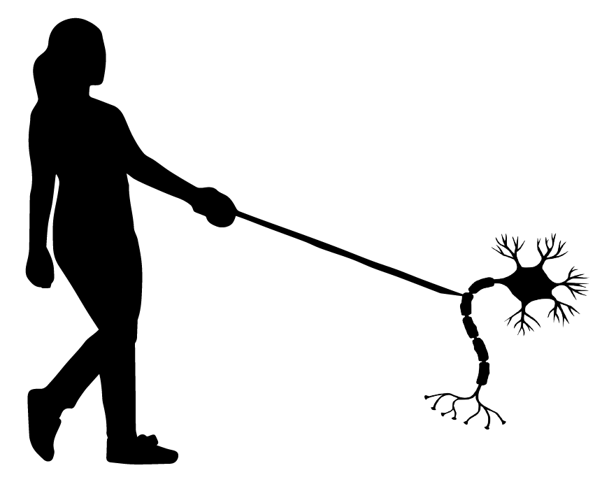

 CellWalkR
================

Installation
------------

Install CellWalkR for R using devtools as follows:

``` r
$ R
> install.packages("devtools")
> devtools::install_github("PFPrzytycki/CellWalkR")
```

Usage
-----

For a guide to using CellWalkR, see the provided [vignette](examples/CellWalkR_Vignette.md), which covers the following:

1.  [Data Pre-processing](examples/CellWalkR_Vignette.md#Data%20Pre-processing)
2.  Getting Started with CellWalkR
    1.  Loading scATAC-seq Data
    2.  Defining Label Nodes
3.  Building a Network
    1.  Computing Cell-Cell Edges
    2.  Computing Label-Cell Edges
4.  Tuning Label Edges
5.  Making a cellWalk Object
6.  Adding Filters
7.  Downstream Analysis
    1.  Cell Labels
    2.  Confusion Matrix
    3.  Hierarchical Clustering of Labels
    4.  Plotting Cells
    5.  Bulk Data Mapping
8.  Interactive Visualizaiton
9.  Adding a Second Set of Labels

If you use CellWalkR please cite:

1.  Przytycki, P.F., Pollard, K.S. CellWalkR: An R Package for integrating single-cell and bulk data to resolve regulatory elements. bioRxiv (2021). <https://doi.org/10.1101/2021.02.23.432593>

2.  Przytycki, P.F., Pollard, K.S. CellWalker integrates single-cell and bulk data to resolve regulatory elements across cell types in complex tissues. Genome Biol 22, 61 (2021). <https://doi.org/10.1186/s13059-021-02279-1>

AWS + TensorFlow
----------------

CellWalkR can also be run on AWS which vastly simplifies the process of running on GPUs using TensorFlow. Using GPUs allows the code to run more than 15 times faster. For a guide to running CellWalkR on AWS using GPUs see this [vignette](examples/CellWalkR_TensorFlow_Vignette.md).
