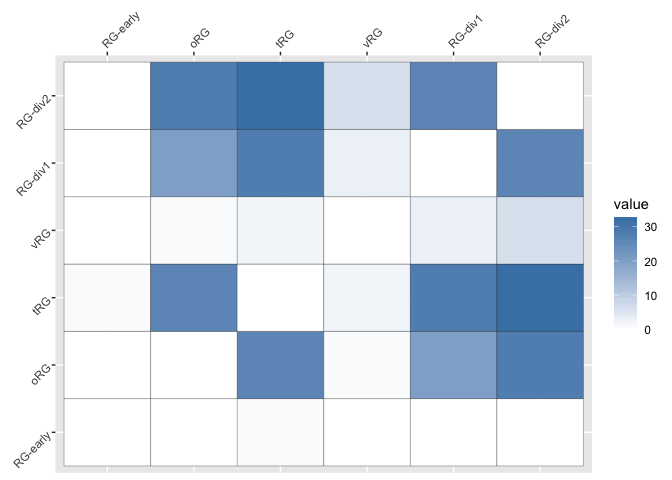
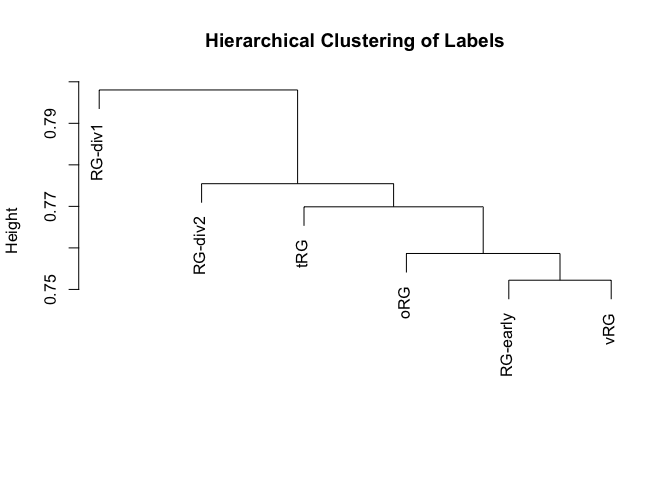
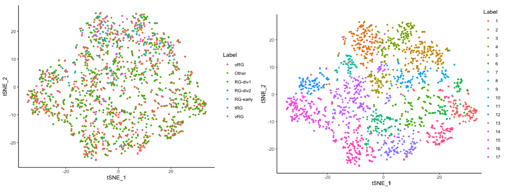
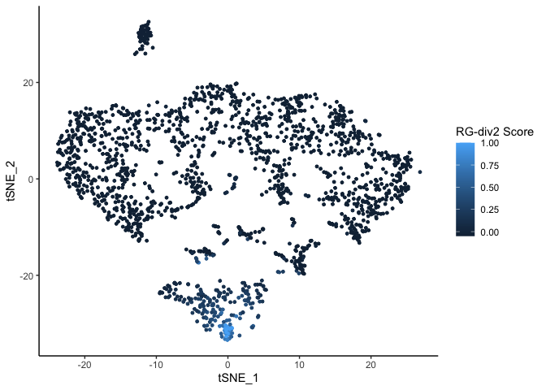
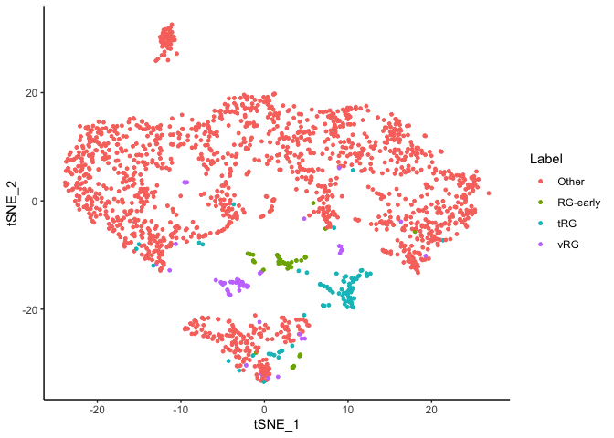
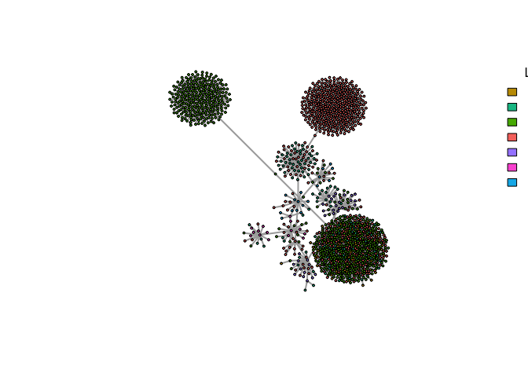
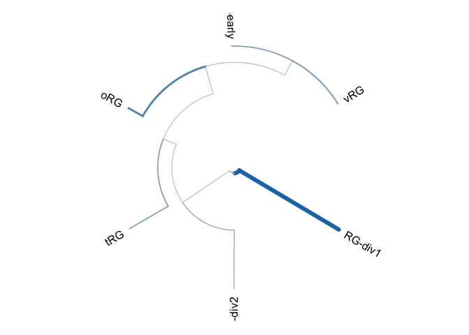
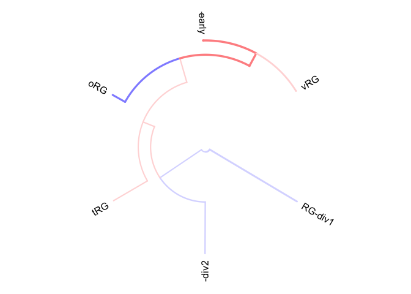
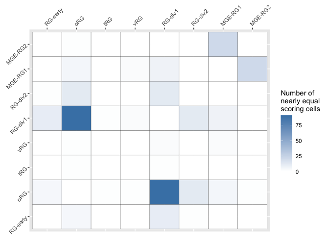
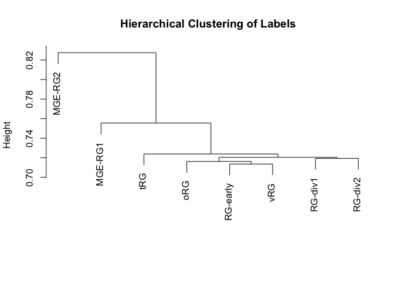

CellWalkR Vignette
================
Pawel F. Przytycki
2022-01-07

## Introduction

CellWalkR is an R package (described
[here](https://doi.org/10.1101/2021.02.23.432593)) implementing the
CellWalker method for combining scATAC-seq data with labels and other
epigenetic data (see [paper](https://doi.org/10.1186/s13059-021-02279-1)
for algorithmic details). This vignette shows an example of running
CellWalkR on a small set of scATAC-seq data to generate a cellWalk
object which can then be used to assign labels to cells as well as
cell-type specific labels to bulk data.

## Data Pre-processing

CellWalkR can work directly with scATAC-seq data pre-processed by many
pipelines including CellRanger, ArchR, SnapATAC, and Cicero. We
recommend using [ArchR](https://www.archrproject.com/) to pre-process
data. ArchR processes BAM or Fragment files into project files that
CellWalkR can use as input. Other common output types of of
pre-processing pipelines such as Cell-by-Peak and Cell-by-Bin matrices
can also be used as input.

## Getting Started with CellWalkR

Currently, CellWalkR must be installed useing devtools:

``` r
install.packages("devtools")
devtools::install_github("PFPrzytycki/CellWalkR")
```

After CellWalkR is installed, load the package:

``` r
library(CellWalkR)
```

#### Loading scATAC-seq Data

CellWalkR can work directly with scATAC-seq data pre-processed by many
pipelines. For this vignette we provide sample data in the form of a
cell-by-peak matrix (included) or an ArchR project (download
[here](https://doi.org/10.6084/m9.figshare.17869094)). This data is the
subset of radial glia cells from [Ziffra et
al](https://doi.org/10.1038/s41586-021-03209-8).

To work with scATAC-seq data in the form of a a cell-by-peak matrix,
load the matrix and the corresponding peaks into a GRanges object as
follows:

``` r
pathToMat <- system.file("extdata", "SamplePeakMat.mtx", package = "CellWalkR")
ATACMat <- Matrix::readMM(pathToMat)
pathToPeaks <- system.file("extdata", "SamplePeaks.txt", package = "CellWalkR")
peaks <- as(data.table::fread(pathToPeaks, header = FALSE)$V1, "GRanges")
```

To work with the ArchR project:

``` r
library('ArchR')
ATACMat <- loadArchRProject(path = "Radial_Glia")
```

To work with SnapATAC, or Cicero data as input (not provided). See
[additional vignette](Other_Data_Vignette.md) for how to load these data
types.

#### Defining Label Nodes

Now we can load our first set of labeling data. For this vignette we
provide a set of labels for radial glia subtypes from [Nowakowski et
al](https://doi.org/10.1126/science.aap8809).

``` r
pathToLabels <- system.file("extdata", "SampleMarkers1.txt", package = "CellWalkR")
labelGenes <- data.table::fread(pathToLabels)
```

If no labeling data is available, findMarkers() can be run on a set of
scRNA-seq data. This requires the Seurat package to be installed and a
gene-by-cell matrix representing the scRNA-data.

``` r
labelGenes <- findMarkers(RNAMat, genes, barcodes)
```

The labeling data should consist of at least two columns, gene names (or
other identifiers that match regions) and associated labels, with an
optional third column for log-fold change in expression of that gene for
that label.

``` r
head(labelGenes)
#>    entrez  cluster   avg_diff
#> 1:  10299 RG-early -1.2297890
#> 2:   6167 RG-early  0.2546596
#> 3:  11168 RG-early  0.2570446
#> 4:   8760 RG-early -0.2578798
#> 5:   8503 RG-early  0.2613031
#> 6:  10208 RG-early  0.2618003
```

## Building a Network

#### Computing Cell-Cell Edges

Next, we compute cell-to-cell similarity in order to build edges in the
cell-to-cell portion of the graph.

``` r
cellEdges <- computeCellSim(ATACMat)
```

cellEdges is a cell-by-cell matrix of cell-to-cell similarity. Any
matrix of cell similarity can be used.

``` r
cellEdges[1:5,1:5]
#> 5 x 5 sparse Matrix of class "dgCMatrix"
#>                                                            
#> [1,] 1.00000000 0.11338151 0.15001705 0.09244314 0.09813385
#> [2,] 0.11338151 1.00000000 0.14950372 0.08130564 0.09035017
#> [3,] 0.15001705 0.14950372 1.00000000 0.08960442 0.11350499
#> [4,] 0.09244314 0.08130564 0.08960442 1.00000000 0.06237177
#> [5,] 0.09813385 0.09035017 0.11350499 0.06237177 1.00000000
```

#### Computing Label-Cell Edges

In order to generate label-to-cell edges, we need to define which
genomic regions correspond to which genes. These could be promoters,
gene bodies, or any other definition. If a specific set of regions
associated with genes isn’t already known, the getRegions() function can
be used to generate a mapping. This function can retrieve hg38 and mm10
mappings. Other mappings can be generated using TxDb objects or biomaRt.

We’ll use hg38 with Entrez identifiers in this example, using full gene
bodies.

``` r
regions <- getRegions(geneBody = TRUE, genome = "hg38", names = "Entrez")
```

regions is a GRanges object with a gene_id field. **This gene_id field
needs to match the genes (or other identifiers) in the labeling data**.

``` r
head(regions)
#> GRanges object with 6 ranges and 1 metadata column:
#>             seqnames            ranges strand |     gene_id
#>                <Rle>         <IRanges>  <Rle> | <character>
#>           1    chr19 58362552-58364751      - |           1
#>          10     chr8 18389282-18391481      + |          10
#>         100    chr20 44652034-44654233      - |         100
#>        1000    chr18 28176931-28179130      - |        1000
#>   100009613    chr11 70075234-70077433      - |   100009613
#>   100009667    chr10 68010663-68012862      - |   100009667
#>   -------
#>   seqinfo: 595 sequences (1 circular) from hg38 genome
```

We then need to map between this data and the peaks in the scATAC-seq
data.

``` r
ATACGenePeak <- mapPeaksToGenes(labelGenes, ATACMat, peaks, regions)
```

With this mapping we can compute label-to-cell edges, a matrix where the
number of columns is the number of labels and the number of rows is the
number of cells.

``` r
labelEdges <- computeLabelEdges(labelGenes, ATACMat, ATACGenePeak)
head(labelEdges)
#>      RG-early         oRG tRG vRG     RG-div1     RG-div2
#> [1,]        0 0.000000000   0   0 0.000000000 0.000000000
#> [2,]        0 0.003770718   0   0 0.004350677 0.003566537
#> [3,]        0 0.004645493   0   0 0.009579770 0.000000000
#> [4,]        0 0.011335104   0   0 0.008159736 0.000000000
#> [5,]        0 0.008066843   0   0 0.005934669 0.000000000
#> [6,]        0 0.000000000   0   0 0.015706707 0.000000000
```

## Tuning Label Edges

Although we now have cell-to-cell edges and label-to-cell edges, we
don’t know how to correctly weight the two relative to each other. The
tuneEdgeWeights method will run CellWalker across a range of possible
parameters and compute cell homogeneity for each. We make a list of
labelEdges because there can be many of them, and sample down to 1000
cells for faster computation. Edge weights can optionally be tuned in
parallel.

``` r
labelEdgesList <- list(labelEdges)
edgeWeights <- tuneEdgeWeights(cellEdges, 
                              labelEdgesList, 
                              labelEdgeOpts = 10^seq(1,7,1), 
                              sampleDepth = 1000)
```

We can see which parameter had the highest cell homogeneity:

``` r
head(edgeWeights[order(edgeWeights$cellHomogeneity, decreasing = TRUE),])
#>    Var1 cellHomogeneity
#> 7 1e+07       1.3175235
#> 6 1e+06       1.2950706
#> 5 1e+05       1.2623739
#> 4 1e+04       0.6141855
#> 3 1e+03       0.1590979
#> 2 1e+02      -0.1880981
```

## Making a cellWalk Object

We generate a cellWalk object with the above tuned edge weight
parameter. This object stores the final influence matrix and can be used
for downstream analysis.

``` r
cellWalk <- walkCells(cellEdges, 
                     labelEdgesList, 
                     labelEdgeWeights = 1e+07)
```

## Adding Filters

We may have some bulk epigenetic data that can help filter down which
peaks are relevant to our analysis. We can tune weights on each filter
to determine how significant it is to our data. For our example we have
H3K4me3 data which indicates active promoters. Thus we apply this filter
permissively (setting filterOut=FALSE) and at the whole gene level
(filterGene=TRUE) rather than just to overlapping peaks.

``` r
pathToFilter <- system.file("extdata", "SampleFilter.bed", package = "CellWalkR")
filter <- data.table::fread(pathToFilter)
filter <- GRanges(filter$V1, IRanges(filter$V2, filter$V3))
```

``` r
filters <- list(filter)
labelGenesList <- list(labelGenes)
filterWeights <- tuneFilterWeights(cellEdges, 
                                  labelGenesList, 
                                  labelEdgesList, 
                                  labelEdgeWeights = 1e+07,
                                  ATACMat,
                                  ATACGenePeak,
                                  filters = filters,
                                  filterOut = c(FALSE),
                                  filterGene = c(TRUE),
                                  regions=regions, 
                                  sampleDepth = 1000)
filterWeights
#>   Var1 cellHomogeneity
#> 1    0        1.313830
#> 2    1        1.314423
```

We see that adding this filter improves performance. We can make a new
cellWalk object using this filter:

``` r
labelEdges <- computeLabelEdges(labelGenes, 
                               ATACMat, 
                               ATACGenePeak,
                               filters = filters, 
                               filterWeights = c(1),
                               filterOut = c(FALSE),
                               filterGene = c(TRUE),
                               regions = regions)
labelEdgesList <- list(labelEdges)
cellWalk <- walkCells(cellEdges, 
                     labelEdgesList, 
                     labelEdgeWeights = 1e+07)
```

Any number of filters can be applied this way. The filters parameters
takes a list of GRanges describing the regions each filter applies to.
Each GRange in the list must have an associated weight, permissiveness,
and gene parameter.

## Downstream Analysis

Once we have created a cellWalk object, we can use it for downstream
analysis.

#### Cell Labels

Most directly, we can look at what labels are the most strongly linked
to each cell. This is based on the maximum amount of label-to-cell
influence in the cell walk. Cell labeling can be used for numerous
further downstream analyses such as cell-type specific peak calling.

``` r
head(cellWalk$cellLabels)
#> [1] "vRG"     "RG-div2" "RG-div1" "oRG"     "oRG"     "RG-div1"
```

#### Confusion Matrix

However, in actuality, labels are “fuzzy” meaning each cell actually has
a distribution of scores from each label. Thanks to this, we can examine
how often labels are confused for each other. The label threshold
determines the minimum influence score a cell must get to be considered
labeled. Plotting requires the packages ggplot2 and reshape2.

``` r
install.packages("ggplot2")
install.packages("reshape2")
```

``` r
cellWalk <- findUncertainLabels(cellWalk, labelThreshold = 0, plot = TRUE)
```

<!-- -->

#### Hierarchical Clustering of Labels

We can also directly examine label similarity by considering
label-to-label influence.

``` r
cellWalk <- clusterLabels(cellWalk,  plot = TRUE)
```

<!-- -->

    #> NULL

#### Plotting Cells

Two-dimensional embeddings of cells can be a very helpful tool for
understanding cell diversity. We can directly embed cell-to-cell
influence scores. Importantly, this portion of the influence matrix is
not used in establishing the labeling of cells. Thus this can serve as
distinct way to explore how labels were distributed across cells.
Because of this, unlike with most scATAC-seq analysis pipelines,
clusters observed in this embedding may not directly correspond to
labels. This can help understand cell diversity, as well as assist in
identifying rare cell types. In addition to ggplot2, embedding also
requires the package Rtsne. Cells can alternatively be embedding using a
UMAP which requires the package uwot.

``` r
install.packages("Rtsne")
```

``` r
cellWalk <- plotCells(cellWalk, labelThreshold = 0, seed = 1)
```

<!-- -->

For comparison, we can take a look at the tSNE that is generated by
SnapATAC directly from the chromatin accessibility data (see code
[here](SnapPlot.md)):<br>
<br>
This embedding does not create a clear separation of labeled cell types
as identified by CellWalkR (left). SnapATAC detects a very large number
of clusters and has no built in ability to detect what cell type they
represent. The clusters all include similar numbers of cells (right).
<br>

It is also possible to plot how strongly a single label influences each
cell in the embedding.

``` r
cellWalk <- plotCells(cellWalk, cellTypes = c("RG-div2"), seed = 1)
```

<!-- -->

Furthermore, to analyze rare cell types, it can be helpful to only plot
a subset of of all labels.

``` r
cellWalk <- plotCells(cellWalk, cellTypes = c("RG-early","tRG","vRG"), labelThreshold = 0, seed = 1)
```

<!-- -->

An alternative to two-dimensional embeddings of cells is to generate a
Minimum Spanning Tree of the cell-to-cell influence scores. This way of
plotting the underlying graph can help emphasize distinct cell types.

``` r
install.packages("igraph")
```

``` r
cellWalk <- computeMST(cellWalk, labelThreshold = 0, seed = 1)
```

<!-- -->

    #> NULL

#### Bulk Data Mapping

A very powerful use for the cell walk is mapping data to labels via
cell-to-label influence. For example, we can map enhancers to cell
types. For this example we will map a set of 1,000 brain enhancers from
the Vista Enhancer Browser.

``` r
pathToEnhancers <- system.file("extdata", "sampleEnhancers.bed", package = "CellWalkR")
sampleEnhancers <- data.table::fread(pathToEnhancers)
sampleEnhancers <- GRanges(sampleEnhancers$V1, 
                           IRanges(sampleEnhancers$V2, sampleEnhancers$V3))
```

``` r
labelScores <- labelBulk(cellWalk, 
                        sampleEnhancers[1:1000], 
                        ATACMat, 
                        peaks,
                        allScores = TRUE)
mappedLabel <- selectLabels(labelScores, z = 1.5)
table(unlist(mappedLabel))
#> 
#>      oRG  RG-div1  RG-div2 RG-early      tRG      vRG 
#>        6       16        1        2        2        3
```

It can help to visualize how these enhancers map to the full hierarchy
of cell types. We can see the total counts of enhancers:

``` r
install.packages("dendextend")
install.packages("circlize")
```

``` r
p <- plotMultiLevelLabels(cellWalk, labelScores, z = 1.5)
```

<!-- -->

    #> 'dendrogram' with 2 branches and 6 members total, at height 0.04581557

Or look where a single enhancer is enriched or depleted:

``` r
p <- plotMultiLevelLabels(cellWalk, labelScores, z = 1.5, whichBulk = 32)
```

<!-- -->

    #> 'dendrogram' with 2 branches and 6 members total, at height 0.04581557

## Interactive Visualzation

Once a cellWalk object has been created, downstream analysis can be
performed using an interactive interface. Several additional R packages
are required for the interface to function:

``` r
install.packages("shiny")
install.packages("plotly")
install.packages("ggplot2")
install.packages("reshape2")
```

To be able to compute label scores for bulk data, the cellWalk object
will need to raw ATAC data to be associated with it:

``` r
cellWalk <- storeMat(cellWalk, ATACMat, peaks)
```

Alternatively, if label scores for bulk data have already been computed,
they can be added to the cellWalk object before launching the
visualization:

``` r
cellWalk <- storeBulk(cellWalk, bulkPeaks=sampleEnhancers[1:1000], labelScores)
```

An interface can be launched as follows:

``` r
launchViz(cellWalk)
```

## Adding a Second Set of Labels

CellWalkR can be run on an arbitrary number of sets of labels and
filters, each with it’s own weight. Filters can selectively be applied
to some sets of labels and not others. Here for example, we will add a
second set of labels to which the above filter does not apply. These
labels are for radial glia derived from the ganglionic eminence rather
than the cortex.

``` r
pathToLabelsB <- system.file("extdata", "SampleMarkers2.txt", package = "CellWalkR")
labelGenesB <- data.table::fread(pathToLabelsB)
```

``` r
ATACGenePeakB <- mapPeaksToGenes(labelGenesB, ATACMat, peaks, regions)
labelEdgesB <- computeLabelEdges(labelGenesB, ATACMat, ATACGenePeakB)
```

Now simply tune edge weights as before with a list of all label edges.

``` r
labelEdgesListB <- list(labelEdges, labelEdgesB)
edgeWeightsB <- tuneEdgeWeights(cellEdges, 
                               labelEdgesListB, 
                               labelEdgeOpts = 10^seq(4,7,1),
                               sampleDepth = 1000)
head(edgeWeightsB[order(edgeWeightsB$cellHomogeneity, decreasing = TRUE),])
#>     Var1  Var2 cellHomogeneity
#> 13 1e+04 1e+07        2.279430
#> 9  1e+04 1e+06        1.992029
#> 12 1e+07 1e+06        1.865972
#> 15 1e+06 1e+07        1.812605
#> 2  1e+05 1e+04        1.722460
#> 10 1e+05 1e+06        1.685628
```

We can then compute a new cell walk using the list of edges and a vector
of optimal weights.

``` r
cellWalkB <- walkCells(cellEdges, 
                      labelEdgesListB, 
                      labelEdgeWeights = c(1e+04, 1e+06))
```

We can take a look at how many cells were assigned the old and new
labels:

``` r
table(cellWalk$cellLabels, cellWalkB$cellLabels)
#>           
#>            MGE-RG1 MGE-RG2 oRG RG-div1 RG-div2 RG-early tRG vRG
#>   oRG          369     100 150      35       2        3   0   1
#>   RG-div1      483     112   0     220       0        3   0   0
#>   RG-div2       68      25   0      10      23        0   0   0
#>   RG-early      11       5   0       0       0        1   0   0
#>   tRG           13      11   0       1       0        0   7   0
#>   vRG           33      21   0       2       0       12   0   2
```

Like before, we can analyze the combined label set with a confusion
matrix and with hierarchical clustering:

``` r
cellWalkB <- findUncertainLabels(cellWalkB, labelThreshold = 0, plot = TRUE)
```

<!-- -->

``` r
cellWalkB <- clusterLabels(cellWalkB,  plot = TRUE)
```

<!-- -->

    #> NULL
