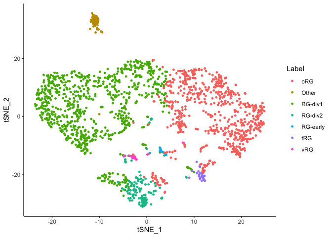
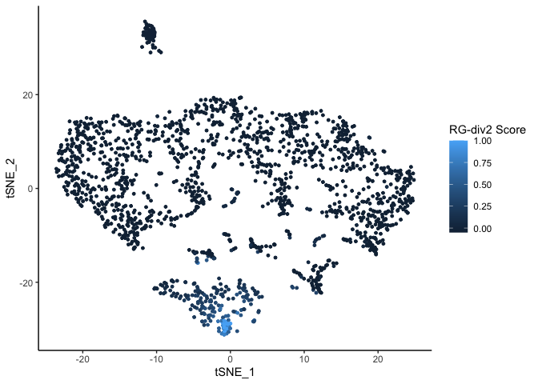
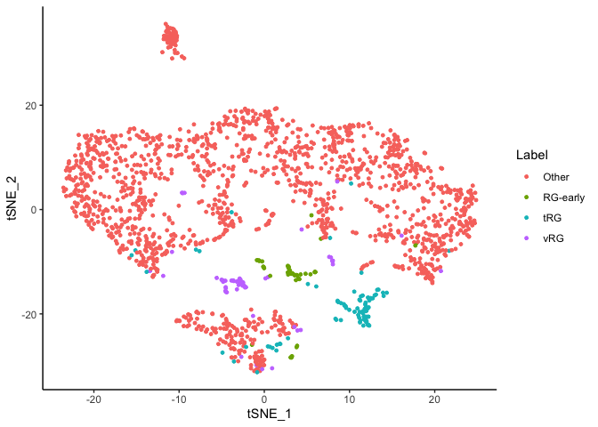

CellWalkR Vignette
================
Pawel F. Przytycki
2021-01-26

Getting Started
---------------

CellWalkR is an R package implementing the CellWalker method for combining scATAC-seq data with labels and other epigenetic data (see [paper](https://www.biorxiv.org/content/10.1101/847657v2) for details). This vignette shows an example of running CellWalkR on a small set of scATAC-seq data to generate a cellWalk object which can then be used to assign labels to cells as well as cell-type specific labels to bulk data.

``` r
library(CellWalkR)
```

First, load scATAC-seq data in the form of a cell-by-peak matrix and load the corresponding peaks into a GRanges object. CellWalkR can also take SnapATAC, ArchR, or Cicero data as input. See [additional vignette](Other_Data_Vignette.md) for how to load these data types.

``` r
pathToMat <- system.file("extdata", "SamplePeakMat.mtx", package = "CellWalkR")
ATACMat <- Matrix::readMM(pathToMat)
pathToPeaks <- system.file("extdata", "SamplePeaks.txt", package = "CellWalkR")
peaks <- as(data.table::fread(pathToPeaks, header = FALSE)$V1, "GRanges")
```

Next, we compute cell-to-cell similarity in order to build edges in the cell-to-cell portion of the graph.

``` r
cellEdges <- computeCellSim(ATACMat, method="Jaccard")
```

cellEdges is a cell-by-cell matrix of cell-to-cell similarity. Any matrix of cell similarity can be used.

``` r
cellEdges[1:5,1:5]
#> 5 x 5 sparse Matrix of class "dgCMatrix"
#>                                                            
#> [1,] 1.00000000 0.11338151 0.15001705 0.09244314 0.09813385
#> [2,] 0.11338151 1.00000000 0.14950372 0.08130564 0.09035017
#> [3,] 0.15001705 0.14950372 1.00000000 0.08960442 0.11350499
#> [4,] 0.09244314 0.08130564 0.08960442 1.00000000 0.06237177
#> [5,] 0.09813385 0.09035017 0.11350499 0.06237177 1.00000000
```

In order to generate label-to-cell edges, we need to define which genomic regions correspond to which genes. These could be promoters, gene bodies, or any other definition. If a specific set of regions associated with genes isn't already known, the getRegions() function can be used to generate a mapping. However this will require installing packages for genomic annotaions (GenomicFeatures and a TxDb object). We'll use the Hg38 in this example.

``` r
install.packages("BiocManager")
BiocManager::install(version = "3.10")
BiocManager::install("GenomicFeatures")
BiocManager::install("TxDb.Hsapiens.UCSC.hg38.knownGene")
```

Now we can generate regions, in this case using full gene bodies.

``` r
regions <- getRegions(geneBody = TRUE, genome = "hg38", names = "Entrez")
```

regions is a GRanges object with a gene\_id field. **This gene\_id field needs to match the genes (or other identifiers) in the labeling data**.

``` r
head(regions)
#> GRanges object with 6 ranges and 1 metadata column:
#>             seqnames            ranges strand |     gene_id
#>                <Rle>         <IRanges>  <Rle> | <character>
#>           1    chr19 58362552-58364751      - |           1
#>          10     chr8 18389282-18391481      + |          10
#>         100    chr20 44652034-44654233      - |         100
#>        1000    chr18 28176931-28179130      - |        1000
#>   100009613    chr11 70075234-70077433      - |   100009613
#>   100009667    chr10 68010663-68012862      - |   100009667
#>   -------
#>   seqinfo: 595 sequences (1 circular) from hg38 genome
```

Now we can load our first set of labeling data. If no labeling data is available, findMarkers() can be run on a set of scRNA-seq data.

``` r
pathToLabels <- system.file("extdata", "SampleMarkers1.txt", package = "CellWalkR")
labelGenes <- data.table::fread(pathToLabels)
```

The labeling data should consist of at least two columns, gene names (or other identifiers that match regions) and associated labels, with an optional third column for log-fold change in expression of that gene for that label.

``` r
head(labelGenes)
#>   entrez  cluster   avg_diff
#> 1  10299 RG-early -1.2297890
#> 2   6167 RG-early  0.2546596
#> 3  11168 RG-early  0.2570446
#> 4   8760 RG-early -0.2578798
#> 5   8503 RG-early  0.2613031
#> 6  10208 RG-early  0.2618003
```

We then need to map between this data and the peaks in the scATAC-seq data.

``` r
ATACGenePeak <- mapPeaksToGenes(labelGenes, ATACMat, peaks, regions)
```

With this mapping we can compute label-to-cell edges, a matrix where the number of columns is the number of labels and the number of rows is the number of cells.

``` r
labelEdges <- computeLabelEdges(labelGenes, ATACMat, ATACGenePeak)
head(labelEdges)
#>      RG-early         oRG tRG vRG     RG-div1     RG-div2
#> [1,]        0 0.000000000   0   0 0.000000000 0.000000000
#> [2,]        0 0.003770718   0   0 0.004350677 0.003566537
#> [3,]        0 0.004645493   0   0 0.009579770 0.000000000
#> [4,]        0 0.011335104   0   0 0.008159736 0.000000000
#> [5,]        0 0.008066843   0   0 0.005934669 0.000000000
#> [6,]        0 0.000000000   0   0 0.015706707 0.000000000
```

Tuning Label Edges
------------------

Although we now have cell-to-cell edges and label-to-cell edges, we don't know how to correctly weight the two relative to each other. The tuneEdgeWeights method will run CellWalker across a range of possible parameters and compute cell homogeneity for each. We make a list of labelEdges because there can be many of them, and sample down to 1000 cells for faster computation.

``` r
labelEdgesList <- list(labelEdges)
edgeWeights <- tuneEdgeWeights(cellEdges, 
                              labelEdgesList, 
                              labelEdgeOpts = 10^seq(1,7,1), 
                              sampleDepth = 1000)
```

We can see which parameter had the highest cell homogeneity:

``` r
head(edgeWeights[order(edgeWeights$cellHomogeneity, decreasing = TRUE),])
#>    Var1 cellHomogeneity
#> 7 1e+07       1.3175235
#> 6 1e+06       1.2950706
#> 5 1e+05       1.2623739
#> 4 1e+04       0.6141855
#> 3 1e+03       0.1590979
#> 2 1e+02      -0.1880981
```

And can generate a cellWalk object with this parameter. This object stores the final influence matrix and can be used for downstream analysis.

``` r
cellWalk <- walkCells(cellEdges, 
                     labelEdgesList, 
                     labelEdgeWeights = 1e+07)
```

Adding Filters
--------------

We may have some bulk epigenetic data that can help filter down which peaks are relevant to our analysis. We can tune weights on each filter to determine how signficant it is to our data. For our example we have H3K4me3 data which indicates active promoters. Thus we apply this filter permissively (setting filterOut=FALSE) and at the whole gene level (filterGene=TRUE) rather than just to overlaping peaks.

``` r
pathToFilter <- system.file("extdata", "SampleFilter.bed", package = "CellWalkR")
filter <- data.table::fread(pathToFilter)
filter <- GRanges(filter$V1, IRanges(filter$V2, filter$V3))
```

``` r
filters <- list(filter)
labelGenesList <- list(labelGenes)
filterWeights <- tuneFilterWeights(cellEdges, 
                                  labelGenesList, 
                                  labelEdgesList, 
                                  labelEdgeWeights = 1e+07,
                                  ATACMat,
                                  ATACGenePeak,
                                  filters = filters,
                                  filterOut = c(FALSE),
                                  filterGene = c(TRUE),
                                  regions=regions, 
                                  sampleDepth = 1000)
filterWeights
#>   Var1 cellHomogeneity
#> 1    0        1.313830
#> 2    1        1.314423
```

We see that adding this filter improves performance. We can make a new cellWalk object using this filter:

``` r
labelEdges <- computeLabelEdges(labelGenes, 
                               ATACMat, 
                               ATACGenePeak,
                               filters = filters, 
                               filterWeights = c(1),
                               filterOut = c(FALSE),
                               filterGene = c(TRUE),
                               regions = regions)
labelEdgesList <- list(labelEdges)
cellWalk <- walkCells(cellEdges, 
                     labelEdgesList, 
                     labelEdgeWeights = 1e+07)
```

Downstream Analysis
-------------------

Once we have created a cellWalk object, we can use it for downstream analysis.

Most directly, we can look at what labels are the most strongly linked to each cell. This is based on the maxiumum amount of label-to-cell influence in the cell walk. Cell labeling can be used for numerous further downstream analyses such as cell-type specific peak calling.

``` r
head(cellWalk$cellLabels)
#> [1] "vRG"     "RG-div2" "RG-div1" "oRG"     "oRG"     "RG-div1"
```

However, in actuality, labels are "fuzzy" meaning each cell actually has a distribution of scores from each label. Thanks to this, we can examine how often labels are confused for each other. The label threshold determines the minimum influence score a cell must get to be considered labeled. Plotting requires the packages ggplot2 and reshape2.

``` r
install.packages("ggplot2")
install.packages("reshape2")
```

``` r
cellWalk <- findUncertainLabels(cellWalk, labelThreshold = 0, plot = TRUE)
```


We can also directly examine label similarity by considering label-to-label influence.

``` r
cellWalk <- clusterLabels(cellWalk,  plot = TRUE)
```


    #> NULL

Two-dimensional embeddings of cells can be a very helpful tool for understanding cell diversity. We can directly embed cell-to-cell influence scores. Importantly, this portion of the influence matrix is not used in establishing the labeling of cells. Thus this can serve as distinct way to explore how labels were distributed accross cells. Because of this, unlike with most scATAC-seq analysis pipelines, clusters observed in this embedding may not directly correspond to labels. This can help understand cell diversity, as well as assist in identifying rare cell types. In addition to ggplot2, embedding also requires the package Rtsne.

``` r
install.packages("Rtsne")
```

``` r
plotCells(cellWalk, labelThreshold = 0, seed = 1)
```



It is also possible to plot how strongly a single label influences each cell in the embedding.

``` r
plotCells(cellWalk, cellTypes = c("RG-div2"), seed = 1)
```



Furthermore, to analyze rare cell types, it can be helpful to only plot a subset of of all labels.

``` r
plotCells(cellWalk, cellTypes = c("RG-early","tRG","vRG"), labelThreshold = 0, seed = 1)
```



A very powerful use for the cell walk is mapping data to labels via cell-to-label influence. For example, we can map enhancers to cell types.

``` r
pathToEnhancers <- system.file("extdata", "sampleEnhancers.bed", package = "CellWalkR")
sampleEnhancers <- data.table::fread(pathToEnhancers)
sampleEnhancers <- GRanges(sampleEnhancers$V1, 
                           IRanges(sampleEnhancers$V2, sampleEnhancers$V3))
```

``` r
mappedLabel <- labelBulk(cellWalk, 
                        sampleEnhancers[1:10], 
                        ATACMat, 
                        peaks)
mappedLabel
#>  [1] "RG-div1"  "RG-early" "RG-early" "RG-early" "RG-early" "RG-div1" 
#>  [7] "RG-early" "RG-early" "RG-early" "RG-early"
```

Adding a Second Set of Labels
-----------------------------

CellWalkR can be run on an arbitrary number of sets of labels and filters, each with it's own weight. Filters can selectively be applied to some sets of labels and not others. Here for example, we will add a second set of labels to which the above filter does not apply.

``` r
pathToLabelsB <- system.file("extdata", "SampleMarkers2.txt", package = "CellWalkR")
labelGenesB <- data.table::fread(pathToLabelsB)
```

``` r
ATACGenePeakB <- mapPeaksToGenes(labelGenesB, ATACMat, peaks, regions)
labelEdgesB <- computeLabelEdges(labelGenesB, ATACMat, ATACGenePeakB)
```

Now simply tune edge weights as before with a list of all label edges.

``` r
labelEdgesListB <- list(labelEdges, labelEdgesB)
edgeWeightsB <- tuneEdgeWeights(cellEdges, 
                               labelEdgesListB, 
                               labelEdgeOpts = 10^seq(4,7,1),
                               sampleDepth = 1000)
head(edgeWeightsB[order(edgeWeightsB$cellHomogeneity, decreasing = TRUE),])
#>     Var1  Var2 cellHomogeneity
#> 14 1e+05 1e+07        2.441033
#> 8  1e+07 1e+05        2.374430
#> 13 1e+04 1e+07        2.162689
#> 12 1e+07 1e+06        2.139192
#> 9  1e+04 1e+06        2.082448
#> 7  1e+06 1e+05        1.871565
```

We can then compute a new cell walk using the list of edges and a vector of optimal weights.

``` r
cellWalkB <- walkCells(cellEdges, 
                      labelEdgesListB, 
                      labelEdgeWeights = c(1e+04, 1e+06))
```
