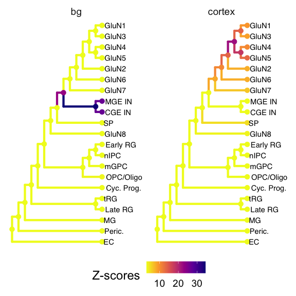
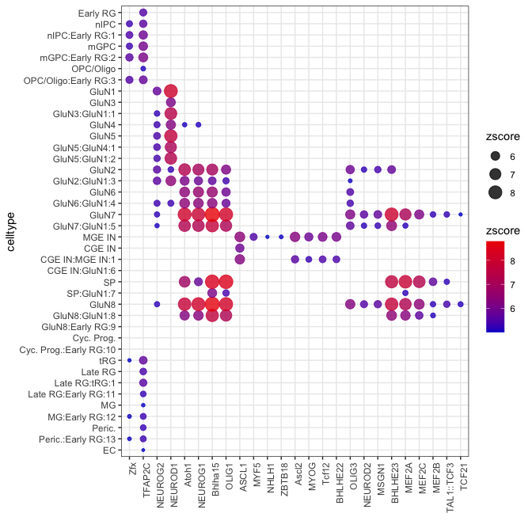
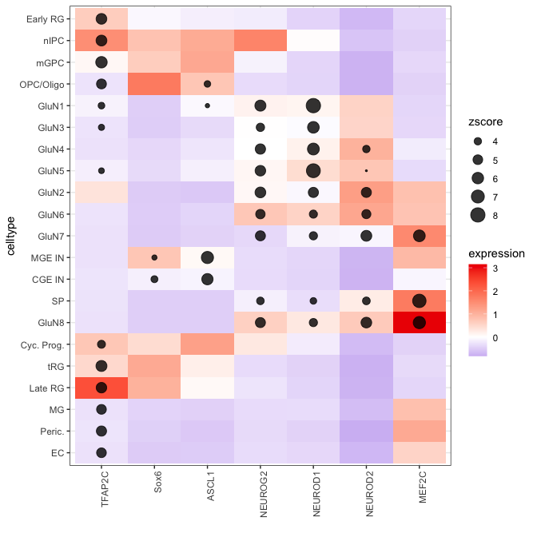
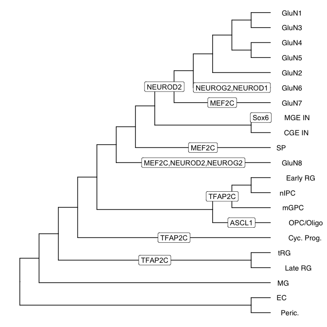
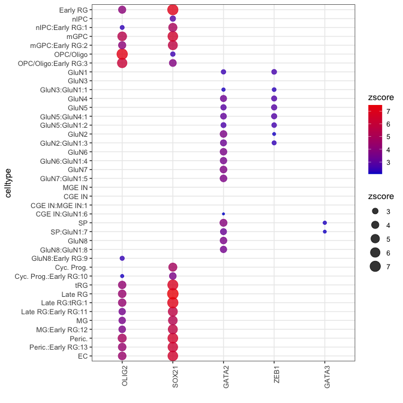

Use CellWalker2 for multiomic data
================
Zhirui Hu
2023-12-14


In this vignette, we will use CellWalker2 to 1) assign cell type labels to predicted regulatory regions (pREs) identified from basal ganglia vs cortex (see [paper](https://doi.org/10.1016/j.cell.2020.06.002)) in human developing brain samples and 2) identify enriched TF motifs or ChIP-Seq peaks within pREs that tend to be more open in specific cell types (candidate cell type specific pREs).

After CellWalkR is installed, load the package:

``` r
library(CellWalkR)
library(data.table)
library(ggplot2)
library(Matrix)
library(ape) # for computation on tree
```
#### Load data

We load subset of multiomic, scRNA-Seq and scATAC-Seq data from human
developing cortex
([GSE162170](https://www.ncbi.nlm.nih.gov/geo/query/acc.cgi?acc=GSE162170)).
For ATAC-Seq, we need to input a peak-by-cell count matrix accompanied
with a peak coordinate matrix with the same rows. We can also load cell
type tree as a phylo object and cell type markers. We rename some of the
columns to make them readable by CellWalker2.

``` r
# load single cell data
# 'data/SampleCellTypeTree.rda' should be loaded upon loading the package
devtools::load_all() # load SampleCortexSingleCellData (in R/sysdata.rda)
#> ℹ Loading CellWalkR

ATAC_Mat = SampleCortexSingleCellData$ATAC_Mat
peaks = SampleCortexSingleCellData$peaks
ATAC_Mat0 = SampleCortexSingleCellData$ATAC_Mat0
peaks0 = SampleCortexSingleCellData$peaks0
counts = SampleCortexSingleCellData$counts
counts2 = SampleCortexSingleCellData$counts2
RNA_markers = SampleCortexSingleCellData$RNA_markers
tr = SampleCellTypeTree

colnames(RNA_markers)[5] = 'p_val_adj' # will be used for select markers
colnames(peaks)[1:3] = c('seqnames', 'start', 'end')
```

#### Process RNASeq data

We first normalize and standarize scRNA-Seq data for both RNASeq part of
multiomic data and unpaired RNASeq data. We don’t need to compute cell
type markers and build cell tree as they are already provided. We also
don’t need to compute cell-to-cell similarities as it will be computed
by integrating all sources of data in the following step.

``` r
dataset1 = processRNASeq(counts, do.findMarkers = F, computeKNN = F, computeSimilarity = F, 
                         buildTree = F) # RNASeq part of multiomic data, normalize data
dataset2 = processRNASeq(counts2, do.findMarkers = F, computeKNN = F, computeSimilarity = F, 
                         buildTree = F) # unpaired RNASeq, normalize data
```

#### Compute cell-to-cell type edges

Then we can compute cell to cell type edges based on standarized marker
gene expression. Users can adjust the p-values and log2 fold change
cutoff to select markers for computing edge weights. Here we just use
the default values.

``` r
# option 1: connect all cells with RNA data to cell types
labelEdges1 = computeTypeEdges(dataset1$expr_norm, RNA_markers)
labelEdges2 = computeTypeEdges(dataset2$expr_norm, RNA_markers)
labelEdges = rbind(labelEdges1, labelEdges2)
```

Users can also choose which cells to be connected to cell types.

``` r
# option 2: connect only cells with unpaired RNA data to cell types
labelEdges = computeTypeEdges(dataset2$expr_norm, RNA_markers)
```

#### Construct cell-to-cell graph

Next, we construct cell-to-cell graph by integrating all the single cell
data. For current version of CellWalker2, multiomic data is required and
unpaired scRNA-Seq or scATAC-Seq data can be added to the graph.
CellWalker2 will compute cell-to-cell similarity based on gene
expression and chromatin accessibility, construct KNN graph and output
shared K nearest neighbors between each pair of cells.

For gene expression, user can adjust the dimensions of PCs to compute
cell-to-cell distance (`ndim`). for chromatin accessibility, user can
choose the similarity metric among Cosine, Jaccard, or LSI.
Additionally, `ATAC_weight` specifies the weight of ATACSeq similarity
for multiomic data (the weight for RNASeq is 1-`ATAC_weight`).

``` r
cellgraph = constructCellGraph(counts, ATAC_Mat0, peaks0, counts2, ATAC_Mat, peaks) # with ATACSeq
```

We can also construct cell graph without unpaired scATAC-Seq:

``` r
cellgraph = constructCellGraph(counts,ATAC_Mat0, peaks0, counts2) # without ATACSeq
```

#### Labeling region-specific pREs by cell types

We further input basal ganglia or cortex specific pREs and compute
cell-to-label edges. In this case, the labels are *basal ganglia* and
*cortex*. The edge weight is based on the chromatin accessibility of
basal ganglia or cortex pREs in the cell.

``` r
pRE = read.csv(system.file("extdata", "pRE_region_bg_cortex.csv", package = "CellWalkR"))
colnames(pRE)[c(1,11)] = c('seqnames', 'cluster') #rename some column names to be readable by CellWalker2

labelEdges1 = computeBulkEdges(pRE, peaks0, ATAC_Mat0)
labelEdges2 = computeBulkEdges(pRE, peaks, ATAC_Mat) 
labelEdges2 = rbind(labelEdges1, labelEdges2) # connect all ATAC cells to bulk annotations
```

Alternatively, we can only connect unpaired ATAC cells to bulk
annotations:

``` r
labelEdges2 = computeBulkEdges(pRE, peaks, ATAC_Mat) 
```

Finally, we assign cell type labels to basal ganglia or cortex specific
pREs. By default, `compute.Zscore = T`, CellWalker2 will compute
Z-scores by comparing the observed influence score with its null
distribution generated by permuting cell-to-cell type edges. Otherwise,
CellWalker2 will output influence score matrix from bulk labels to cell
types only. `nround` is the number of randomization to compute Z-scores.

We set `labelEdgeWeight = NULL`, so CellWalker2 will tune the weight
ratio between cell-to-label edges and cell-to-cell edges for both cell
type labels and bulk annotations to minimize the entropy mapping each
bulk annotation to cell types.

``` r
cellWalk2 = annotateBulkRegion(cellgraph, labelEdges, labelEdges2, tr1 = tr, wtree = c(1, 0.1),
                               labelEdgeWeights = NULL, sampleDepth = 2000,  parallel = T, 
                               numCores = 8) # with tuning edgeWeights
#> tunning labelEdgeWeights...
#> labelHomogeneity at optimal edgeWeight:
#>    Var1 Var2 cellHomogeneity
#> 26 1000 0.01      0.09840338
#> run CellWalker:
#> Warning: executing %dopar% sequentially: no parallel backend registered
#> permutation round 0
#> permutation round 1
#> permutation round 2
#> permutation round 3
#> permutation round 4
#> permutation round 5
#> permutation round 6
#> permutation round 7
#> permutation round 8
#> permutation round 9
#> permutation round 10
#> permutation round 11
#> permutation round 12
#> permutation round 13
#> permutation round 14
#> permutation round 15
#> permutation round 16
#> permutation round 17
#> permutation round 18
#> permutation round 19
#> permutation round 20
#> permutation round 21
#> permutation round 22
#> permutation round 23
#> permutation round 24
#> permutation round 25
#> permutation round 26
#> permutation round 27
#> permutation round 28
#> permutation round 29
#> permutation round 30
#> permutation round 31
#> permutation round 32
#> permutation round 33
#> permutation round 34
#> permutation round 35
#> permutation round 36
#> permutation round 37
#> permutation round 38
#> permutation round 39
#> permutation round 40
#> permutation round 41
#> permutation round 42
#> permutation round 43
#> permutation round 44
#> permutation round 45
#> permutation round 46
#> permutation round 47
#> permutation round 48
#> permutation round 49
#> permutation round 50
```

If you don’t want to tune `leblEdgeWeight`, you can use the following
command using the default values or input other values.

``` r
cellWalk2 = annotateBulkRegion(cellgraph, labelEdges, labelEdges2, tr1 = tr, wtree = c(1, 0.1))
```

We plot Z-score on the cell type tree to compare the cell type
specificity of different bulk annotations.

``` r
tr$node.label = colnames(cellWalk2$zscore)[-1:-(tr$Nnode+1)]
p1 = plotZscoreTree(tr, cellWalk2$zscore, cutoff = 3)
p1
```



#### Mapping transcription factors to cell types using motifs

First, we input the genomic coordinates of pREs as a bed file and
identify TF motifs from JASPAR2020 within each pRE using Signac. For
faster computation in this demo, we also filter for TF motifs that occur
more frequently. The result file contains the genomic coordinates of
each pRE and the motifs within it. Currently only hg38 is supported in
`findMotifs` but users can input custom motifs file.

``` r
pRE = read.table(system.file("extdata", "pRE-hg38.bed", package = "CellWalkR"))
colnames(pRE) = c('seqnames', 'start', 'end')
motifs = findMotifs(pRE)
#> 
#> Warning: Keys should be one or more alphanumeric characters followed by an
#> underscore, setting key from peaks to peaks_
#> Building motif matrix
#> Finding motif positions
#> Creating Motif object

motifs = data.table::as.data.table(motifs)
motifs[, count:= .N, by = cluster] # select TFs appear in more pREs
motifs = as.data.frame(motifs[count > 1000])
```

Then, we compute cell-to-label edges. We treat each TF as a bulk label
and each TF connects to each cell through the chromatin accessibilty of
pREs containing the TF motif. We connect both cells from multiomic and
unpaired ATACSeq to TFs.

``` r
labelEdges1 = computeBulkEdges(motifs, peaks0, ATAC_Mat0)
labelEdges2 = computeBulkEdges(motifs, peaks, ATAC_Mat)
labelEdges2 = rbind(labelEdges1, labelEdges2)
```

Finally, we identify TFs whose motifs are enriched in pREs that are
active in specific cell types. We convert `motifs` to a binary matrix
showing the present/absence of motif in each pRE that can be used by
`annotateBulkRegion`.

Different from previous section, we randomly assign pREs to motifs to
generate the null distribution for computing Z-scores. We set `groups1`
to all zero as no permutation between cell-to cell types edges and
`group2` to all one as permutations occur between all motifs and
regions. We need to input count matrix and peaks for ATACSeq data as we
need to recompute `labelEdges` for each randomization.

``` r
regionMat = convertToMatrix(motifs) # a data.table with sequence name of pRE as the first column and clusters (TFs) as the following columns
groups1 =  rep(0, nrow(labelEdges)) # no permutation between cell-to cell types edges
groups2 = rep(1, nrow(regionMat)) # permutation between all motifs and regions
cellWalk2 = annotateBulkRegion(cellgraph, labelEdges, labelEdges2, groups1, groups2,
                               regionMat, list(ATAC_Mat0, ATAC_Mat), list(peaks0, peaks), 
                               tr1 = tr, wtree = c(1, 0.1), labelEdgeWeights = NULL, sampleDepth = 2000,
                               parallel = T, numCores = 8)
#> tunning labelEdgeWeights...
#> labelHomogeneity at optimal edgeWeight:
#>    Var1 Var2 cellHomogeneity
#> 53 1000   10      0.09761161
#> run CellWalker:
#> permutation round 0
#> permutation round 1
#> Using sequence_name as id variables
#> permutation round 2
#> Using sequence_name as id variables
#> permutation round 3
#> Using sequence_name as id variables
#> permutation round 4
#> Using sequence_name as id variables
#> permutation round 5
#> Using sequence_name as id variables
#> permutation round 6
#> Using sequence_name as id variables
#> permutation round 7
#> Using sequence_name as id variables
#> permutation round 8
#> Using sequence_name as id variables
#> permutation round 9
#> Using sequence_name as id variables
#> permutation round 10
#> Using sequence_name as id variables
#> permutation round 11
#> Using sequence_name as id variables
#> permutation round 12
#> Using sequence_name as id variables
#> permutation round 13
#> Using sequence_name as id variables
#> permutation round 14
#> Using sequence_name as id variables
#> permutation round 15
#> Using sequence_name as id variables
#> permutation round 16
#> Using sequence_name as id variables
#> permutation round 17
#> Using sequence_name as id variables
#> permutation round 18
#> Using sequence_name as id variables
#> permutation round 19
#> Using sequence_name as id variables
#> permutation round 20
#> Using sequence_name as id variables
#> permutation round 21
#> Using sequence_name as id variables
#> permutation round 22
#> Using sequence_name as id variables
#> permutation round 23
#> Using sequence_name as id variables
#> permutation round 24
#> Using sequence_name as id variables
#> permutation round 25
#> Using sequence_name as id variables
#> permutation round 26
#> Using sequence_name as id variables
#> permutation round 27
#> Using sequence_name as id variables
#> permutation round 28
#> Using sequence_name as id variables
#> permutation round 29
#> Using sequence_name as id variables
#> permutation round 30
#> Using sequence_name as id variables
#> permutation round 31
#> Using sequence_name as id variables
#> permutation round 32
#> Using sequence_name as id variables
#> permutation round 33
#> Using sequence_name as id variables
#> permutation round 34
#> Using sequence_name as id variables
#> permutation round 35
#> Using sequence_name as id variables
#> permutation round 36
#> Using sequence_name as id variables
#> permutation round 37
#> Using sequence_name as id variables
#> permutation round 38
#> Using sequence_name as id variables
#> permutation round 39
#> Using sequence_name as id variables
#> permutation round 40
#> Using sequence_name as id variables
#> permutation round 41
#> Using sequence_name as id variables
#> permutation round 42
#> Using sequence_name as id variables
#> permutation round 43
#> Using sequence_name as id variables
#> permutation round 44
#> Using sequence_name as id variables
#> permutation round 45
#> Using sequence_name as id variables
#> permutation round 46
#> Using sequence_name as id variables
#> permutation round 47
#> Using sequence_name as id variables
#> permutation round 48
#> Using sequence_name as id variables
#> permutation round 49
#> Using sequence_name as id variables
#> permutation round 50
#> Using sequence_name as id variables
```

We can visualize Z-scores using dotplot. Each row is a cell type
including internal nodes on the tree and each column is a TF. The
internal node is names by two cell types among its descendents and the
depth of the node.

``` r
Zscore = cellWalk2$zscore[, tr$edge[,2]] # reorder cell types so that cell types closer in the tree will be closer on the heatmap
p1 = plotZscoreDotplot(Zscore, th = 5)
p1
```



We can further filter TFs by the average expression in each cell type,
and the correlation between average expression and Z-scores. First, load
log normalized scRNA-Seq data for TFs.

``` r
tf_exp = SampleCortexSingleCellData$tf_exp # tf expression for each cell
label = SampleCortexSingleCellData$label # cell labels
# remove cell types less than 5 cells
ct_num = xtabs(~label)
clusters = names(ct_num)[which(ct_num > 4)]
cell_ind = which(label %in% clusters)
label = label[cell_ind]
tf_exp = tf_exp[, cell_ind]
```

Then, we compute average expression in each cell type.

``` r
#If tr is provided, also compute selected internal nodes of the cell type tree. If scale = T, get standardized expression for each gene
computeTFexp <- function(tf_exp, Zscore, cellLabels, tr = NULL, levels = c(1:8,12), scale = T)
{
  # select expressed TF
  ind = which(rowMeans(tf_exp > 0) > 0.01) # 
  tf_exp = tf_exp[ind, ]
  tf_exp = as.matrix(tf_exp)
  # get tf expression per cell type
  if(scale) tf_exp = t(scale(t(tf_exp)))
  tf_exp = reshape2::melt(tf_exp)
  
  tf_exp = tf_exp[tf_exp$Var2 %in% names(cellLabels), ]
  tf_exp$cluster = cellLabels[as.character(tf_exp$Var2)] 
  
  tf_exp = as.data.table(tf_exp)
  tf_exp_mean = tf_exp[, mean(value),  by = c('Var1', 'cluster')]
  ##tf_exp_mean$cluster = make.names(tf_exp_mean$cluster)
  tf_exp_mean = reshape2::acast(tf_exp_mean, Var1 ~ cluster)
  
  # adding internal nodes
  if(!is.null(tr))
  {
    #select levels of internal nodes to compute expression. In this example, only bottom 8 levels (for different groups of neurons)
    # and level 12 (for non-neurons) will be computed
    for(i in levels) 
    {
      nodes = grep(paste0('\\:', i, '$'), tr$node.label, value = T)
      tf_exp$cluster2 = NA
      for(x in nodes)
      {
        a = extract.clade(tr, x)
        if(length(a$tip.label) > length(tr$tip.label)/2  + 1) a$tip.label = setdiff(tr$tip.label, a$tip.label)
        if(i==12) x = "Peric.:Early RG:13"
        tf_exp$cluster2[which(tf_exp$cluster %in% a$tip.label)] = x
      }
      temp = tf_exp[!is.na(cluster2), mean(value),  by = c('Var1', 'cluster2')]
      tf_exp_mean = cbind(tf_exp_mean, reshape2::acast(temp, Var1 ~ cluster2))
    }
  }
  inter_tf = intersect(rownames(tf_exp_mean), rownames(Zscore))
  Zscore = Zscore[inter_tf, colnames(tf_exp_mean)]
  tf_exp_mean = tf_exp_mean[inter_tf,]
  return(list(Zscore,tf_exp_mean)) 
}
res = computeTFexp(tf_exp, Zscore, label)
#> Using V1 as value column: use value.var to override.
```

We can filter TFs by Z-score, expression and correlation:

``` r
# compute correlation
corr = sapply(1:nrow(res[[1]]), function(x) cor(unlist(res[[1]][x,]), unlist(res[[2]][x,]), method= 'spearman'))
names(corr) = rownames(res[[1]])
posTF = corr[corr > 0.2] # less strict cutoff as demo
nn = sapply(1:ncol(res[[1]]), function(i) { # iterate over all the cell types
  y = sum(res[[1]][,i] >3) # select TFs with Z-score > 3
  x = order(-res[[1]][,i])[1:min(50,y)] # further top 50 TFs if too many to plot
  x = rownames(res[[1]])[x]
  intersect(intersect(x, rownames(res[[2]])[res[[2]][,i] > 0.5]), names(posTF)) # select TF with standarized expression (>0.5) and correlation
  })
names(nn) = colnames(res[[1]])
tfs = unique(unlist(nn))
```

Then we plot Z-score and expression in the same heatmap.

``` r
# ord: order of TFs in the heatmap. If not provided, will order TF by clustering Z-scores
# ord2: order of cell types in the heatmap. If not provided, will order cell types by clustering Z-scores
# th: only plot Z-score if it is above th. 
convert2plot <- function(Zscore, tf_exp_mean, label = 'zscore', th = 3, ord2 = NULL, ord = NULL)
{
  Zscore2 = Zscore
  Zscore2[Zscore2<th] = 0
  if(is.null(ord))
  {
    ord = hclust(dist(Zscore2, method = 'manhattan')) # clustering similar TF motifs, zscore1
    ord = ord$order
  }
  if(is.null(ord2))
  {
    ord2 = hclust(dist(t(Zscore2), method = 'manhattan')) # clustering similar TF motifs, zscore1
    ord2 = ord2$order
  }
  Zscore = Zscore[ord, ord2]
  
  Zscore2 = Zscore
  Zscore2[Zscore2 < th] = NA
  Zscore2 = as.matrix(Zscore2)
  Zscore2 = reshape2::melt(Zscore2)
  colnames(Zscore2) = c('enhancer', 'celltype', label) 
  
  tf_exp_mean = tf_exp_mean[ord,ord2]
  all(rownames(Zscore) == rownames(tf_exp_mean))
  all(colnames(Zscore) == colnames(tf_exp_mean))
  
  tf_exp_mean2 = reshape2::melt(as.matrix(tf_exp_mean))
  colnames(tf_exp_mean2) = c('enhancer', 'celltype', 'expression') 
  tf_exp_mean2[tf_exp_mean2$expression > 5, 'expression'] = 5 
  return(list(Zscore2, tf_exp_mean2))
}
ord2 = na.omit(tr$tip.label[tr$edge[,2]])
res2 = convert2plot(res[[1]][tfs,], res[[2]][tfs,], ord2 = ord2)
ggplot(res2[[1]], aes(x=enhancer , y=celltype, group=enhancer)) +
  geom_tile(data = res2[[2]], mapping =  aes(fill= expression)) + geom_point(aes(size = zscore),  alpha = 0.8) + xlab('') +
  theme_bw() +theme(axis.text.x = element_text(angle = 90, hjust=1)) + 
  scale_fill_gradient2(low = "mediumblue",  high = "red2", space = "Lab") + scale_size(range = c(0.5, 6))
```



Lastly, we can plot top TFs on the cell type tree.

``` r

# get top TFs for each cell type including internal nodes
res = computeTFexp(tf_exp, Zscore, label, tr = tr)
#> Using V1 as value column: use value.var to override.
#> Using V1 as value column: use value.var to override.
#> Using V1 as value column: use value.var to override.
#> Using V1 as value column: use value.var to override.
#> Using V1 as value column: use value.var to override.
#> Using V1 as value column: use value.var to override.
#> Using V1 as value column: use value.var to override.
#> Using V1 as value column: use value.var to override.
#> Using V1 as value column: use value.var to override.
#> Using V1 as value column: use value.var to override.
nn = sapply(1:ncol(res[[1]]), function(i) { # iterate over all the cell types
  y = sum(res[[1]][,i] >3) # select TFs with Z-score > 3
  x = order(-res[[1]][,i])[1:min(50,y)] # further top 50 TFs if too many to plot
  x = rownames(res[[1]])[x]
  intersect(intersect(x, rownames(res[[2]])[res[[2]][,i] > 0.5]), names(posTF)) # select TF with standarized expression (>0.5) and correlation
  })
names(nn) = colnames(res[[1]])
trr <- root(tr, outgroup = c('Peric.','EC'), resolve.root = TRUE)
tr1 = trr
tr1$node.label = sapply(nn[trr$node.label], function(x) paste(x, collapse = ','))
tr1$tip.label = sapply(nn[trr$tip.label], function(x) paste(x, collapse = ','))

# reduce TFs on the cell type tree: each TF will only appear in the most upstream node in which the TF is selected
nodes = which(!is.na(names(tr1$node.label)))
for(e in nodes)
{
  st = subtrees(tr1)
  a = tr1$node.label[e]
  a = strsplit(a, ',')[[1]]
  for(i in 1:length(st[[e]]$tip.label))
  {
    b = st[[e]]$tip.label[i]
    if(b == '') next
    tr1$tip.label[names(b)]  = paste(setdiff(strsplit(b, ',')[[1]], a), collapse = ',')
  }
  if(length(st[[e]]$node.label) < 2) next
  for(i in 2:length(st[[e]]$node.label))
  {
    b = st[[e]]$node.label[i]
    if(b == '') next
    tr1$node.label[names(b)]  = paste(setdiff(strsplit(b, ',')[[1]], a), collapse = ',')
  }
}

td <- data.frame(node = 1:length(trr$tip.label),
                'TFs' = tr1$tip.label, check.names = F)
nd <- data.frame(node = (1:length(trr$node.label)) + length(trr$tip.label),
                 'TFs' = tr1$node.label, check.names = F)
d <- rbind(td, nd)
d[d$TFs=='', 'TFs'] = NA
tree <- full_join(trr, d, by = 'node')

ggtree(tree, branch.length = 'none') + geom_tiplab(hjust = -0.5) + xlim(0, 15) + geom_label(aes(x = branch, label=TFs)) 
```



#### Mapping transcription factors to cell types using ChIP-Seq peaks

Instead motifs, we can input TF ChIP-Seq peaks in the brain and use
CellWalker2 to identify cell type-specific TFs. We collected ChIP-Seq
data from
[ReMap2022](https://remap.univ-amu.fr/storage/remap2022/hg38/MACS2/remap2022_nr_macs2_hg38_v1_0.bed.gz).
Only subset of peaks present in the brain are included in the following analysis. 

First, to be comparable with the TF motif analysis above, we obtain pREs overlapping with ChIP-Seq peaks for each TF in the brain.
 
``` r
# input ChIP-Seq
chipseq = readRDS(system.file("extdata", 'remap2022_nr_macs2_hg38_brain_tfs.rds', package = "CellWalkR"))
# overlap ChIPSeq peaks with pRE
chip_peaks = GRanges(chipseq[,1:3])
pRE = GRanges(pRE)
overlaps = findOverlaps(chip_peaks, pRE)
chipseq2 = cbind(chipseq[queryHits(overlaps), ], as.data.frame(pRE[subjectHits(overlaps),]))
chipseq2 = unique(chipseq2[, c(5:7,4)])
```

Then, we compute cell-to-label edges. We treat each TF as a bulk label
and each TF connects to each cell through the chromatin accessibilty of
pREs with TF ChIP-Seq peaks. We connect both cells from multiomic and
unpaired ATACSeq to TFs.

``` r
labelEdges1 = computeBulkEdges(chipseq2, peaks0, ATAC_Mat0)
labelEdges2 = computeBulkEdges(chipseq2, peaks, ATAC_Mat)
labelEdges2 = rbind(labelEdges1, labelEdges2)
```

Finally, we identify TFs whose peaks are enriched in pREs that are
active in specific cell types. We convert `chipseq2` to a binary matrix
showing the present/absence of peaks in each pRE that can be used by
`annotateBulkRegion`.

``` r
regionMat = convertToMatrix(chipseq2) # a data.table with sequence name of pRE as the first column and clusters (TFs) as the following columns
groups1 =  rep(0, nrow(labelEdges)) # no permutation between cell-to cell types edges
groups2 = rep(1, nrow(regionMat)) # permutation between all motifs and regions
cellWalk2_chip = annotateBulkRegion(cellgraph, labelEdges, labelEdges2, groups1, groups2,
                               regionMat, list(ATAC_Mat0, ATAC_Mat), list(peaks0, peaks), 
                               tr1 = tr, wtree = c(1, 0.1), labelEdgeWeights = NULL, sampleDepth = 2000,
                               parallel = T, numCores = 8)
#> tunning labelEdgeWeights...
#> labelHomogeneity at optimal edgeWeight:
#>   Var1  Var2 cellHomogeneity
#> 8 1000 1e-04       0.1079188
#> run CellWalker:
#> permutation round 0
#> permutation round 1
#> Using sequence_name as id variables
#> permutation round 2
#> Using sequence_name as id variables
#> permutation round 3
#> Using sequence_name as id variables
#> permutation round 4
#> Using sequence_name as id variables
#> permutation round 5
#> Using sequence_name as id variables
#> permutation round 6
#> Using sequence_name as id variables
#> permutation round 7
#> Using sequence_name as id variables
#> permutation round 8
#> Using sequence_name as id variables
#> permutation round 9
#> Using sequence_name as id variables
#> permutation round 10
#> Using sequence_name as id variables
#> permutation round 11
#> Using sequence_name as id variables
#> permutation round 12
#> Using sequence_name as id variables
#> permutation round 13
#> Using sequence_name as id variables
#> permutation round 14
#> Using sequence_name as id variables
#> permutation round 15
#> Using sequence_name as id variables
#> permutation round 16
#> Using sequence_name as id variables
#> permutation round 17
#> Using sequence_name as id variables
#> permutation round 18
#> Using sequence_name as id variables
#> permutation round 19
#> Using sequence_name as id variables
#> permutation round 20
#> Using sequence_name as id variables
#> permutation round 21
#> Using sequence_name as id variables
#> permutation round 22
#> Using sequence_name as id variables
#> permutation round 23
#> Using sequence_name as id variables
#> permutation round 24
#> Using sequence_name as id variables
#> permutation round 25
#> Using sequence_name as id variables
#> permutation round 26
#> Using sequence_name as id variables
#> permutation round 27
#> Using sequence_name as id variables
#> permutation round 28
#> Using sequence_name as id variables
#> permutation round 29
#> Using sequence_name as id variables
#> permutation round 30
#> Using sequence_name as id variables
#> permutation round 31
#> Using sequence_name as id variables
#> permutation round 32
#> Using sequence_name as id variables
#> permutation round 33
#> Using sequence_name as id variables
#> permutation round 34
#> Using sequence_name as id variables
#> permutation round 35
#> Using sequence_name as id variables
#> permutation round 36
#> Using sequence_name as id variables
#> permutation round 37
#> Using sequence_name as id variables
#> permutation round 38
#> Using sequence_name as id variables
#> permutation round 39
#> Using sequence_name as id variables
#> permutation round 40
#> Using sequence_name as id variables
#> permutation round 41
#> Using sequence_name as id variables
#> permutation round 42
#> Using sequence_name as id variables
#> permutation round 43
#> Using sequence_name as id variables
#> permutation round 44
#> Using sequence_name as id variables
#> permutation round 45
#> Using sequence_name as id variables
#> permutation round 46
#> Using sequence_name as id variables
#> permutation round 47
#> Using sequence_name as id variables
#> permutation round 48
#> Using sequence_name as id variables
#> permutation round 49
#> Using sequence_name as id variables
#> permutation round 50
#> Using sequence_name as id variables
```

We can visualize Z-scores using ChIP-Seq peaks using dotplot. Each row
is a cell type including internal nodes on the tree and each column is a
TF. The internal node is names by two cell types among its descendents
and the depth of the node.

``` r
Zscore_chip = cellWalk2_chip$zscore[, tr$edge[,2]] # reorder cell types so that cell types closer in the tree will be closer on the heatmap
p1 = plotZscoreDotplot(Zscore_chip, th = 2)
p1
```



## Session Information

``` r
sessionInfo()
#> R version 4.2.1 (2022-06-23)
#> Platform: aarch64-apple-darwin20 (64-bit)
#> Running under: macOS 14.6.1
#> 
#> Matrix products: default
#> BLAS:   /Library/Frameworks/R.framework/Versions/4.2-arm64/Resources/lib/libRblas.0.dylib
#> LAPACK: /Library/Frameworks/R.framework/Versions/4.2-arm64/Resources/lib/libRlapack.dylib
#> 
#> locale:
#> [1] en_US.UTF-8/en_US.UTF-8/en_US.UTF-8/C/en_US.UTF-8/en_US.UTF-8
#> 
#> attached base packages:
#> [1] parallel  stats4    stats     graphics  grDevices utils     datasets 
#> [8] methods   base     
#> 
#> other attached packages:
#>  [1] CellWalkR_1.0.0      doParallel_1.0.17    iterators_1.0.14    
#>  [4] foreach_1.5.2        ape_5.7-1            Matrix_1.5-4.1      
#>  [7] ggplot2_3.4.2        data.table_1.14.8    GenomicRanges_1.50.2
#> [10] GenomeInfoDb_1.34.9  IRanges_2.32.0       S4Vectors_0.36.2    
#> [13] BiocGenerics_0.44.0 
#> 
#> loaded via a namespace (and not attached):
#>   [1] utf8_1.2.3                        R.utils_2.12.2                   
#>   [3] spatstat.explore_3.2-1            reticulate_1.34.0                
#>   [5] tidyselect_1.2.0                  AnnotationDbi_1.60.2             
#>   [7] poweRlaw_0.70.6                   RSQLite_2.3.1                    
#>   [9] htmlwidgets_1.6.2                 grid_4.2.1                       
#>  [11] BiocParallel_1.32.6               Rtsne_0.16                       
#>  [13] devtools_2.4.5                    munsell_0.5.0                    
#>  [15] codetools_0.2-19                  ica_1.0-3                        
#>  [17] future_1.32.0                     miniUI_0.1.1.1                   
#>  [19] withr_2.5.0                       spatstat.random_3.1-5            
#>  [21] colorspace_2.1-0                  progressr_0.13.0                 
#>  [23] Biobase_2.58.0                    highr_0.10                       
#>  [25] knitr_1.43                        rstudioapi_0.14                  
#>  [27] Seurat_4.3.0.1                    ROCR_1.0-11                      
#>  [29] tensor_1.5                        listenv_0.9.0                    
#>  [31] MatrixGenerics_1.10.0             labeling_0.4.2                   
#>  [33] GenomeInfoDbData_1.2.9            polyclip_1.10-4                  
#>  [35] bit64_4.0.5                       farver_2.1.1                     
#>  [37] rprojroot_2.0.3                   parallelly_1.36.0                
#>  [39] vctrs_0.6.3                       treeio_1.22.0                    
#>  [41] generics_0.1.3                    xfun_0.39                        
#>  [43] R6_2.5.1                          DelayedArray_0.24.0              
#>  [45] bitops_1.0-7                      spatstat.utils_3.0-3             
#>  [47] cachem_1.0.8                      gridGraphics_0.5-1               
#>  [49] BiocIO_1.8.0                      promises_1.2.0.1                 
#>  [51] scales_1.2.1                      gtable_0.3.3                     
#>  [53] globals_0.16.2                    processx_3.8.1                   
#>  [55] goftest_1.2-3                     seqLogo_1.64.0                   
#>  [57] rlang_1.1.1                       RcppRoll_0.3.0                   
#>  [59] splines_4.2.1                     rtracklayer_1.58.0               
#>  [61] lazyeval_0.2.2                    spatstat.geom_3.2-1              
#>  [63] yaml_2.3.7                        reshape2_1.4.4                   
#>  [65] abind_1.4-5                       httpuv_1.6.11                    
#>  [67] tools_4.2.1                       usethis_2.2.1                    
#>  [69] ggplotify_0.1.0                   ellipsis_0.3.2                   
#>  [71] RColorBrewer_1.1-3                sessioninfo_1.2.2                
#>  [73] ggridges_0.5.4                    Rcpp_1.0.10                      
#>  [75] plyr_1.8.8                        zlibbioc_1.44.0                  
#>  [77] purrr_1.0.1                       RCurl_1.98-1.12                  
#>  [79] ps_1.7.5                          prettyunits_1.1.1                
#>  [81] deldir_1.0-9                      pbapply_1.7-0                    
#>  [83] cowplot_1.1.1                     urlchecker_1.0.1                 
#>  [85] zoo_1.8-12                        SummarizedExperiment_1.28.0      
#>  [87] SeuratObject_4.1.3                ggrepel_0.9.3                    
#>  [89] cluster_2.1.4                     fs_1.6.2                         
#>  [91] motifmatchr_1.20.0                magrittr_2.0.3                   
#>  [93] scattermore_1.2                   lmtest_0.9-40                    
#>  [95] RANN_2.6.1                        Signac_1.10.0                    
#>  [97] ggnewscale_0.4.9                  fitdistrplus_1.1-11              
#>  [99] matrixStats_1.0.0                 pkgload_1.3.2                    
#> [101] hms_1.1.3                         patchwork_1.1.2                  
#> [103] mime_0.12                         evaluate_0.21                    
#> [105] xtable_1.8-4                      XML_3.99-0.14                    
#> [107] gridExtra_2.3                     testthat_3.1.9                   
#> [109] compiler_4.2.1                    tibble_3.2.1                     
#> [111] KernSmooth_2.23-21                crayon_1.5.2                     
#> [113] R.oo_1.25.0                       htmltools_0.5.5                  
#> [115] tzdb_0.4.0                        ggfun_0.1.1                      
#> [117] later_1.3.1                       TFBSTools_1.36.0                 
#> [119] tidyr_1.3.0                       aplot_0.1.10                     
#> [121] DBI_1.1.3                         MASS_7.3-60                      
#> [123] readr_2.1.4                       brio_1.1.3                       
#> [125] cli_3.6.1                         R.methodsS3_1.8.2                
#> [127] igraph_1.5.0                      pkgconfig_2.0.3                  
#> [129] GenomicAlignments_1.34.1          TFMPvalue_0.0.9                  
#> [131] sp_2.0-0                          plotly_4.10.2                    
#> [133] spatstat.sparse_3.0-2             annotate_1.76.0                  
#> [135] ggtree_3.6.2                      JASPAR2020_0.99.10               
#> [137] DirichletMultinomial_1.40.0       XVector_0.38.0                   
#> [139] yulab.utils_0.0.6                 BSgenome.Hsapiens.UCSC.hg38_1.4.5
#> [141] stringr_1.5.0                     callr_3.7.3                      
#> [143] digest_0.6.31                     pracma_2.4.2                     
#> [145] sctransform_0.3.5                 RcppAnnoy_0.0.20                 
#> [147] CNEr_1.34.0                       spatstat.data_3.0-1              
#> [149] Biostrings_2.66.0                 fastmatch_1.1-3                  
#> [151] rmarkdown_2.22                    leiden_0.4.3                     
#> [153] tidytree_0.4.2                    uwot_0.1.15                      
#> [155] restfulr_0.0.15                   Rsamtools_2.14.0                 
#> [157] shiny_1.7.4                       gtools_3.9.4                     
#> [159] rjson_0.2.21                      lifecycle_1.0.3                  
#> [161] nlme_3.1-162                      jsonlite_1.8.5                   
#> [163] BSgenome_1.66.3                   desc_1.4.2                       
#> [165] viridisLite_0.4.2                 fansi_1.0.4                      
#> [167] pillar_1.9.0                      lattice_0.21-8                   
#> [169] GO.db_3.16.0                      KEGGREST_1.38.0                  
#> [171] fastmap_1.1.1                     httr_1.4.6                       
#> [173] pkgbuild_1.4.2                    survival_3.5-5                   
#> [175] glue_1.6.2                        remotes_2.4.2                    
#> [177] png_0.1-8                         bit_4.0.5                        
#> [179] stringi_1.7.12                    profvis_0.3.8                    
#> [181] blob_1.2.4                        caTools_1.18.2                   
#> [183] memoise_2.0.1                     dplyr_1.1.2                      
#> [185] irlba_2.3.5.1                     future.apply_1.11.0
```
