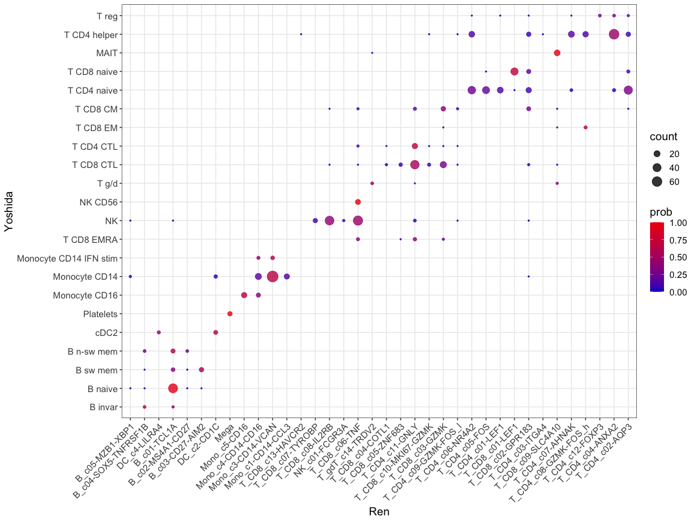
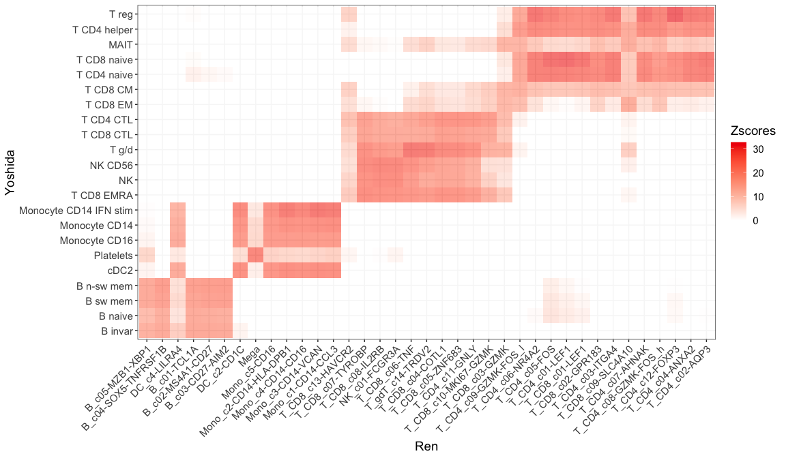
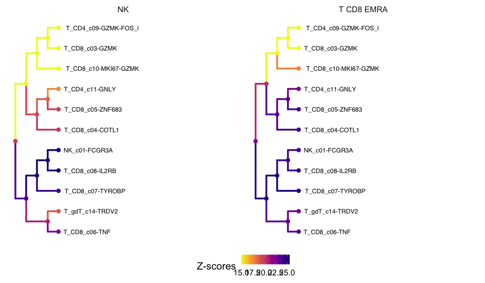

Using CellWalker2 for scRNA-Seq data
================
Zhirui Hu
2023-12-14


After CellWalkR is installed, load the package and its dependencies:


``` r
library(CellWalkR)
library(data.table)
library(ggplot2)
library(Matrix)
```


In this vignette, we show how to use CellWalker2 to annotate cells by
reference cell type labels (or tree) and how to compare two sets of cell type labels
(or trees) using human PBMC scRNA-Seq datasets. The full data is
downloaded from
[CellTypist](https://celltypist.cog.sanger.ac.uk/Resources/Organ_atlas/Blood/Blood.h5ad)
and we subsampled 2% cells to reduce compute time for demonstration purposes. 
To illustrate cell type annotation, we treat [Ren et
al.](https://pubmed.ncbi.nlm.nih.gov/33657410/) as the reference dataset
and [Yoshida et al.](https://www.nature.com/articles/s41586-021-04345-x)
as unlabeled cells. We use cell types and marker genes obtained from Ren et
al. to annotate cells in Yoshida et al.. To illustrate cell type
mapping, we use CellWalker2 to identify the correspondence between cell
type labels (or trees) from these two datasets.

#### load scRNA-Seq data

``` r
load('../data-raw/Ren_subsample.rdat')
load('../data-raw/Yoshida_subsample.rdat')

# remove cell types with too few cells (less than 5)
cts = sort(xtabs(~meta.data1$Original_annotation))
lowcts = names(cts)[cts < 5]
ind_rm = which(meta.data1$Original_annotation %in% lowcts) 
counts1 = counts1[, -ind_rm]
meta.data1 = meta.data1[-ind_rm, ]

cts = sort(xtabs(~meta.data2$Original_annotation))
lowcts = names(cts)[cts < 5]
ind_rm = which(meta.data2$Original_annotation %in% lowcts) 
counts2 = counts2[, -ind_rm]
meta.data2 = meta.data2[-ind_rm, ]
```

#### Labeling cells

CellWalker2 uses Seurat to preprocess scRNA-Seq data. Users can provide
marker genes for each cell type as a dataframe with columns *gene*,
*cluster,* *avg_log2FC* (optional). If not provided, CellWalker2 can
compute cell type marker genes from a reference scRNA-Seq dataset.
Optionally, user can provide a cell type tree as a phylo object. If not
provided, CellWalker2 can also build a cell type tree from a reference
scRNA-Seq dataset.

We compute cell type markers and the hierarchical relationships between
cell type labels using the reference dataset (Ren et al.). To do that, we
use `Original_annotation` column in `meta.data1` as the cell labels. We also
compute the cell-to-cell similarity graph for the query dataset (Yoshida et
als.) as a part of the graph on which we will run the random walk. Since we only use a
small subset of cells here, we chose to input the cell type markers and cell type tree
computed using the full reference dataset (alternatively, the user can compute markers and tree from the input dataset by setting
`do.findMarkers = T, buildTree = T`).

``` r
dataset1= processRNASeq(counts1, meta.data1, group.col = 'Original_annotation', do.findMarkers = F, 
                        computeKNN = F, buildTree = F)
#> The legacy packages maptools, rgdal, and rgeos, underpinning the sp package,
#> which was just loaded, will retire in October 2023.
#> Please refer to R-spatial evolution reports for details, especially
#> https://r-spatial.org/r/2023/05/15/evolution4.html.
#> It may be desirable to make the sf package available;
#> package maintainers should consider adding sf to Suggests:.
#> The sp package is now running under evolution status 2
#>      (status 2 uses the sf package in place of rgdal)
#> Centering and scaling data matrix

dataset2 = processRNASeq(counts2, do.findMarkers = F, computeKNN = T)
#> Warning: Feature names cannot have underscores ('_'), replacing with dashes
#> ('-')
#> Centering and scaling data matrix
#> Computing nearest neighbor graph
#> Computing SNN
#> Modularity Optimizer version 1.3.0 by Ludo Waltman and Nees Jan van Eck
#> 
#> Number of nodes: 923
#> Number of edges: 35457
#> 
#> Running Louvain algorithm...
#> Maximum modularity in 10 random starts: 0.8638
#> Number of communities: 6
#> Elapsed time: 0 seconds
#markers = dataset1$markers  # if do.findMarkers = T
markers = read.csv('../data-raw/Ren_markers.csv')
tree = readRDS('../data-raw/Ren_tree.rds')
tree = ape::keep.tip(tree, unique(meta.data1$Original_annotation))# only keep the tips exist in current dataset
dataset1$tr = tree
dataset1$markers = markers
```

Then, we compute the cell-to-label edges based on standardized gene
expression level of marker genes.

``` r
labelEdges = computeTypeEdges(dataset2$expr_norm, markers)
```

Finally, we annotate query cells by cell type labels either
hierarchically organized or not. `weight1` is the edge weight ratio
between cell-label edges and cell-cell edges, which controls the
information that flows from labels to the cells. If it’s NULL,
CellWalker2 will tune this parameter by a subsample of the cells
(specified by `sampleDepth`). This parameter is tuned such that similar
cells will have larger influence score. The range of possible values is
provided by `labelEdgeOpts`. As tuning will take longer time, we provide
the option to run different values in parallel by setting `parallel = T`.
If a cell type tree is provided, `wtree` specifies the edge weight
between cell type labels.

with hierarchical structure:

``` r
results = annotateCells(dataset2$cellGraph, labelEdges, weight1 = NULL, sampleDepth =1000,
                        labelEdgeOpts = 10^seq(-5,3,1),  tr1 = dataset1$tr,
                        wtree = 10)
#> Warning in tuneEdgeWeights(cellGraph, labelEdgesList, sampleDepth =
#> sampleDepth, : Sample depth is greater than number of cells, will use all cells
#> cellHomogeneity at each edgeWeight:
#>    Var1 cellHomogeneity
#> 1 1e-05       0.3837290
#> 2 1e-04       0.3736373
#> 3 1e-03       0.2327312
#> 4 1e-02       0.1833579
#> 5 1e-01       0.2114337
#> 6 1e+00       4.5254681
#> 7 1e+01       2.8002018
#> 8 1e+02       0.1175620
#> 9 1e+03       0.1337027
```

without hierarchical structure (not run):

``` r
results_notree = annotateCells(dataset2$cellGraph, labelEdges, weight1 = NULL, sampleDepth =1000,
                        labelEdgeOpts = 10^seq(-5,3,1))
```

with parallel computing in tuning weight1 (not run):

``` r
results_parallel = annotateCells(dataset2$cellGraph, labelEdges, weight1 = NULL, sampleDepth =1000,
                        labelEdgeOpts = 10^seq(-5,3,1), parallel  = T,  numCores = 8)
```

We compare the cell annotation result with the orignal annotation in the
query dataset:

``` r
cellLabel = results[[1]]$cellLabels[rownames(meta.data2)] # cell type labels from CellWalker2
aa = data.frame('Yoshida' = meta.data2$Original_annotation, 'Ren' = cellLabel) # combine with original annotation
aa = data.table(aa)
aa = aa[, list(count= .N), by = c('Yoshida', 'Ren')]
aa[, prob:= count/sum(count), by =  'Yoshida']

load('../data-raw/Ren_Yoshida_celltype_order.rdat') # load cell type orders for dotplot

aa$Ren = factor(aa$Ren, levels = ll)
aa$Yoshida = factor(aa$Yoshida, levels = ll2)

ggplot(aa, aes(x= Ren, y=Yoshida, size=count, color=prob, group=Ren)) + 
  geom_point(alpha = 0.8) + 
  theme_bw() +theme(axis.text.x = element_text(angle = 45, hjust=1), text = element_text(size = 14)) + 
  scale_color_gradient(low = "mediumblue",  high = "red2", space = "Lab", limit = c(0, 1))+scale_size(range = c(0.5, 6)) 
```



#### Comparing cell types or cell type trees

To map cell types, CellWalker2 needs marker genes for each cell type and
(optionally) cell type tree. We’ve already obtained marker genes for
reference in the last section, so we only need to compute markers for
query. This step can be skipped if marker genes (and tree) are provided
from external data. Here, as we only input a sampled data, we input
precomputed markers and cell type tree using the full data.

``` r
dataset2= processRNASeq(counts2, meta.data2, group.col = 'Original_annotation', do.findMarkers = F, 
                        computeKNN = F, buildTree = F) # set do.findMarkers = T, buildTree = T if compute markers and cell type tree
#> Warning: Feature names cannot have underscores ('_'), replacing with dashes
#> ('-')
#> Centering and scaling data matrix
dataset2$markers = read.csv('../data-raw/Yoshida_markers.csv')

tree = readRDS('../data-raw/Yoshida_tree.rds')
tree = ape::keep.tip(tree, unique(meta.data2$Original_annotation))# only keep the tips exist in current dataset
dataset2$tr = tree
```

Although not the main purpose of CellWalker2, if the dataset is
unlabeled, CellWalker2 can identify cell clusters first and map cell
clusters among datasets.

Then, we compute the cell-to-label edges based on gene expression level
of marker genes, merge the data from both datasets to compute a
cell-to-cell graph. If `integrate = F`, just combine the data together
without removing batch effect; if `integrate = T`, will use CCA method
in Seurat to integrate data.

``` r
labelEdges1 = computeTypeEdges(dataset1$expr_norm, dataset1$markers)
labelEdges2 = computeTypeEdges(dataset2$expr_norm, dataset2$markers, log2FC.cutoff = 0.25) # adjust log2FC to be smaller to increase number of markers
labelEdgesList = list(labelEdges1, labelEdges2) # make sure that cell names are different in each dataset
mergeResult =  mergeRNASeq(list(counts1, counts2), nfeatures = 5000) # make sure that cell names are different in each dataset. if there are cell names are duplicated, will add '_x' to cell names
#> Warning: Feature names cannot have underscores ('_'), replacing with dashes
#> ('-')
#> Scaling features for provided objects
#> Finding all pairwise anchors
#> Running CCA
#> Merging objects
#> Finding neighborhoods
#> Finding anchors
#>  Found 4065 anchors
#> Filtering anchors
#>  Retained 3161 anchors
#> Merging dataset 2 into 1
#> Extracting anchors for merged samples
#> Finding integration vectors
#> Finding integration vector weights
#> Integrating data
```

Finally, we run CellWalker2 to map the cell types between the two datasets
either with or without the hierarchical structure of cell type labels.
We set `labelEdgeWeight = NULL`, so CellWalker2 will tune the weight
ratio between cell-to-label edges and cell-to-cell edges for each set of
label, which controls the information that flows from labels to the
cells. These parameters are tuned such that similar cells will have
larger influence. By setting `parallel = T` and specifying `numCores`,
CellWalker2 will tune edgeWeights in parallel. `sampleDepth` specifies
the number of cells subsampled to tune these parameters. Smaller sample
size will accelerate tuning but might be less optimal.

If `compute.Zscore = T`, CellWalker2 will compute Z-scores by comparing
the observed influence score with its null distribution generated by
permuting cell-to-label edges. Otherwise, CellWalker2 will output
influence score matrix between labels only. `nround` is the number of
random permutations used to compute Z-scores.

CellWalker2 will output influence scores or Z-scores from cell types in
dataset1 to those in dataset2 and vice versa (which may not be identical).

CellWalker2 uses `%dppar%` to run each randomization parellally.
`foreach` and `doParallel` packages are required and you need to
register the parallel backend before running `mapCellTypes`.

``` r
library(foreach)
library(doParallel)
cl<-makeCluster(8)  # change to smaller if your machine doesn't have enough cores
registerDoParallel(cl)  # for computing Z-score
```

without hierarchical structure (not run):

``` r
cellWalk2_notree = mapCellTypes(mergeResult$cellGraph, labelEdgesList, labelEdgeWeights = NULL,
                         compute.Zscore = TRUE,  nround = 55, parallel  = T,  
                         sampleDepth =1000, numCores = 8)
```

with hierarchical structure (not run):

``` r
treeList = list(dataset1$tr, dataset2$tr)
cellWalk2 = mapCellTypes(mergeResult$cellGraph, labelEdgesList, labelEdgeWeights = NULL,
                         treeList = treeList, compute.Zscore = TRUE,  nround = 55,
                         parallel  = T,  sampleDepth =1000, numCores = 8)

# if encounter error in serialize(data, node$con), can try re-initiate by:
# stopCluster(cl)
# cl<-makeCluster(8)
# registerDoParallel(cl)
```

By default, CellWalker2 will permute the edge weights between cells to
each set of cell type labels independently. We can also choose which set
of cell-to-label edges to permute and/or to restrict permutation within
cell groups by setting `groupsList`, as sometimes we want to maintain
the (phylogenetic) correlation of edge weights between cell type labels.

Here we show how to only permute edges between cells to labels of query
dataset as we want to map each cell type label in query to reference and
keep the hierarchical structure of labels in reference dataset. For
edges between cells to labels in reference dataset, the user should set all the cells
to group 0 so the edge weights are not permuted. For edges between cells
to labels in query dataset, the user should set all the cells to a single group (e.g. 1) so
that edge weights are permuted between all the cells to labels.

Moreover, the user can adjust the edge weight going up and down the cell type
tree to discourage information going across lineages. In this case, as
we only consider the information flow from query to reference, for cell
type tree in reference dataset, the user should set the edge weight going up the tree
(from tips to root) to 1 and down to 0.1, and set the opposite for
cell tree in the query dataset.

Though CellWalker2 will output scores in both directions, the influence
scores or Z-scores from query to reference dataset should be used in
this setting.

``` r
# it may take a while to run
treeList = list(dataset1$tr, dataset2$tr)
# different weights going up/down the tree
groupsList = list(rep(0, nrow(labelEdges1)), rep(1, nrow(labelEdges2)))
wtrees = matrix(c(1,0.1,0.1,1), ncol=2) # first row for dataset 1 and second for dataset 2
cellWalk2_map = mapCellTypes(mergeResult$cellGraph, labelEdgesList, labelEdgeWeights = NULL,
                         treeList = treeList, wtrees = wtrees, groupsList = groupsList,
                         compute.Zscore = TRUE, nround = 55, parallel  = T,  
                         sampleDepth =1000, numCores = 8)
#> tunning labelEdgeWeights...
#> cellHomogeneity at optimal edgeWeight:
#>    Var1 Var2 cellHomogeneity
#> 67  0.1 1000        7.225065
#> run CellWalker:
#> some of variances are zero or negative when computing Z-score
```

Alternatively, we can connect all the cells to both marker sets if the
genes from both datasets are mostly shared.

``` r
# not run
labelEdges1 = rbind(computeTypeEdges(dataset1$expr_norm, dataset1$markers),
              computeTypeEdges(dataset2$expr_norm, dataset1$markers))
labelEdges2 = rbind(computeTypeEdges(dataset1$expr_norm, dataset2$markers),
              computeTypeEdges(dataset2$expr_norm, dataset2$markers))
labelEdgesList = list(labelEdges1, labelEdges2) # make sure that cell names are different in each dataset
```

We can check the cell type mapping and plot Z-score matrix:

``` r
Zscore = cellWalk2_map$zscore[[2]]
res = RcppHungarian::HungarianSolver(-Zscore[1:(nrow(Zscore) -1),1:(ncol(Zscore) -1)])$pairs # no root, remove '-1' if running without tree
res[,1] = sapply(rownames(Zscore)[res[,1]], function(x) sub('_[0-9]$', '', x))
res[,2] = sapply(colnames(Zscore)[as.numeric(res[,2])], function(x) sub('_[0-9]$', '', x))
colnames(res) = c('Yoshida labels', 'Ren labels')
message("matching cell labels with Zscore (with tree): ")
#> matching cell labels with Zscore (with tree):
options(width = 200)
print(res) # mapping cell types using Zscore
#>       Yoshida labels                           Ren labels                                   
#>  [1,] "T CD4 helper"                           "T_CD4_c01-LEF1:T_CD4_c03-ITGA4:2"           
#>  [2,] "T CD8 EM"                               "T_CD8_c10-MKI67-GZMK:T_CD4_c09-GZMK-FOS_l:2"
#>  [3,] "NK"                                     "NK_c01-FCGR3A"                              
#>  [4,] "T CD8 CTL"                              "T_CD8_c04-COTL1:T_CD4_c11-GNLY:2"           
#>  [5,] "T CD4 naive"                            "T_CD4_c01-LEF1:T_CD8_c01-LEF1:1"            
#>  [6,] "T CD4 CTL"                              "T_CD4_c11-GNLY"                             
#>  [7,] "Monocyte CD14"                          "Mono_c4-CD14-CD16"                          
#>  [8,] "B sw mem"                               "B_c02-MS4A1-CD27"                           
#>  [9,] "Monocyte CD16"                          "Mono_c5-CD16"                               
#> [10,] "T CD8 naive"                            "T_CD4_c05-FOS"                              
#> [11,] "MAIT"                                   "T_CD8_c09-SLC4A10:T_CD4_c08-GZMK-FOS_h:2"   
#> [12,] "T CD8 EMRA"                             "T_CD8_c04-COTL1"                            
#> [13,] "B n-sw mem"                             "B_c02-MS4A1-CD27:B_c03-CD27-AIM2:1"         
#> [14,] "NK CD56"                                "T_CD8_c08-IL2RB"                            
#> [15,] "B naive"                                "B_c01-TCL1A"                                
#> [16,] "T g/d"                                  "T_CD8_c06-TNF:T_gdT_c14-TRDV2:1"            
#> [17,] "T CD8 CM"                               "T_CD4_c09-GZMK-FOS_l"                       
#> [18,] "cDC2"                                   "Mono_c3-CD14-VCAN"                          
#> [19,] "T reg"                                  "T_CD8_c09-SLC4A10:T_CD4_c02-AQP3:3"         
#> [20,] "Monocyte CD14 IFN stim"                 "Mono_c3-CD14-VCAN:Mono_c1-CD14-CCL3:1"      
#> [21,] "Platelets"                              "Mega"                                       
#> [22,] "B invar"                                "B_c04-SOX5-TNFRSF1B"                        
#> [23,] "Platelets:B n-sw mem:8"                 "Mega:T_CD4_c02-AQP3:9"                      
#> [24,] "Monocyte CD16:B n-sw mem:7"             "DC_c2-CD1C"                                 
#> [25,] "Monocyte CD16:Monocyte CD14 IFN stim:2" "Mono_c5-CD16:Mono_c4-CD14-CD16:2"           
#> [26,] "Monocyte CD14:Monocyte CD14 IFN stim:1" "Mono_c1-CD14-CCL3"                          
#> [27,] "T CD4 helper:B n-sw mem:6"              "Mono_c2-CD14-HLA-DPB1"                      
#> [28,] "T CD4 helper:NK CD56:5"                 "T_CD8_c07-TYROBP:T_gdT_c14-TRDV2:3"         
#> [29,] "T CD4 helper:T CD8 CM:4"                "T_CD4_c07-AHNAK:T_CD4_c08-GZMK-FOS_h:1"     
#> [30,] "T CD4 helper:T CD8 naive:2"             "T_CD4_c06-NR4A2:T_CD4_c05-FOS:1"            
#> [31,] "T CD4 helper:T reg:1"                   "T_CD4_c12-FOXP3:T_CD4_c02-AQP3:2"           
#> [32,] "T CD4 naive:T CD8 naive:1"              "T_CD4_c01-LEF1"                             
#> [33,] "T CD8 EM:T CD8 CM:3"                    "T_CD8_c03-GZMK:T_CD4_c09-GZMK-FOS_l:1"      
#> [34,] "MAIT:T CD8 CM:2"                        "T_CD8_c09-SLC4A10"                          
#> [35,] "T g/d:T CD8 CM:1"                       "T_CD8_c03-GZMK"                             
#> [36,] "T CD8 EMRA:NK CD56:3"                   "T_CD8_c07-TYROBP:NK_c01-FCGR3A:2"           
#> [37,] "T CD8 EMRA:T CD4 CTL:2"                 "T_CD8_c05-ZNF683"                           
#> [38,] "T CD8 CTL:T CD4 CTL:1"                  "T_CD8_c05-ZNF683:T_CD4_c11-GNLY:1"          
#> [39,] "NK:NK CD56:1"                           "T_CD8_c08-IL2RB:NK_c01-FCGR3A:1"            
#> [40,] "cDC2:B n-sw mem:4"                      "DC_c4-LILRA4"                               
#> [41,] "B invar:B n-sw mem:3"                   "B_c03-CD27-AIM2"                            
#> [42,] "B naive:B n-sw mem:2"                   "B_c01-TCL1A:B_c03-CD27-AIM2:2"
```

``` r
bb = reshape2::melt(Zscore[1:((nrow(Zscore) + 1)/2),1:((ncol(Zscore) + 1)/2)]) # only plot tips for illustration
bb$Var1 = sub( '_[0-9]$', '',bb$Var1)
bb$Var2 = sub( '_[0-9]$', '',bb$Var2)
colnames(bb) = c('Yoshida','Ren', 'Zscores') 
bb$Ren = factor(bb$Ren, levels = ll)
bb$Yoshida = factor(bb$Yoshida, levels = ll2)

ggplot(bb, aes(x= Ren, y=Yoshida, group=Ren)) + 
  geom_tile(aes(fill=Zscores), alpha = 0.6) + theme_bw() + 
  theme(axis.text.x = element_text(angle = 45, hjust=1), 
        text = element_text(size = 14)) + 
  scale_fill_gradient(low = "white",  high = "red2", space = "Lab")
```



We can also plot the Z-score on the cell type tree:

``` r
tr = treeList[[1]]
tr$node.label = colnames(Zscore)[-1:-(tr$Nnode+1)]
tr$node.label = sub('_[0-9]$', '',tr$node.label)
dat = Zscore[c('NK_2', 'T CD8 EMRA_2'),, drop=F]
colnames(dat) =  sub('_[0-9]$', '',colnames(dat))
rownames(dat) =  sub('_[0-9]$', '',rownames(dat))
cl1 = ape::extract.clade(tr, 'T_CD8_c07-TYROBP:T_gdT_c14-TRDV2:3')
cl2 = ape::extract.clade(tr, 'T_CD8_c04-COTL1:T_CD4_c09-GZMK-FOS_l:3')
subtr = ape::keep.tip(tr, c(cl1$tip.label, cl2$tip.label))
subtr = ape::keep.tip(tr, c(cl1$tip.label, cl2$tip.label))
pp = CellWalkR::plotZscoreTree(subtr, dat[,c(subtr$tip.label, subtr$node.label)], cutoff = 15)
plot(pp)
```



CellWalker can also map more than two datasets (not shown here).


## Session Information


```r
sessionInfo()
#> R version 4.2.1 (2022-06-23)
#> Platform: aarch64-apple-darwin20 (64-bit)
#> Running under: macOS Monterey 12.6
#> 
#> Matrix products: default
#> LAPACK: /Library/Frameworks/R.framework/Versions/4.2-arm64/Resources/lib/libRlapack.dylib
#> 
#> locale:
#> [1] en_US.UTF-8/en_US.UTF-8/en_US.UTF-8/C/en_US.UTF-8/en_US.UTF-8
#> 
#> attached base packages:
#> [1] parallel  stats4    stats     graphics  grDevices utils     datasets  methods   base     
#> 
#> other attached packages:
#>  [1] CellWalkR_1.0.0             doParallel_1.0.17           iterators_1.0.14            foreach_1.5.2               splatter_1.21.1             scater_1.26.1               ggplot2_3.4.2              
#>  [8] scuttle_1.8.4               SingleCellExperiment_1.20.1 SummarizedExperiment_1.28.0 Biobase_2.58.0              MatrixGenerics_1.10.0       matrixStats_1.0.0           GenomicRanges_1.50.2       
#> [15] GenomeInfoDb_1.34.9         IRanges_2.32.0              S4Vectors_0.36.2            BiocGenerics_0.44.0        
#> 
#> loaded via a namespace (and not attached):
#>   [1] rtracklayer_1.58.0                scattermore_1.2                   R.methodsS3_1.8.2                 SeuratObject_4.1.3                tidyr_1.3.0                      
#>   [6] JASPAR2020_0.99.10                bit64_4.0.5                       knitr_1.43                        irlba_2.3.5.1                     DelayedArray_0.24.0              
#>  [11] R.utils_2.12.2                    data.table_1.14.8                 KEGGREST_1.38.0                   TFBSTools_1.36.0                  RCurl_1.98-1.12                  
#>  [16] generics_0.1.3                    ScaledMatrix_1.6.0                callr_3.7.3                       cowplot_1.1.1                     usethis_2.2.1                    
#>  [21] RSQLite_2.3.1                     RANN_2.6.1                        future_1.32.0                     bit_4.0.5                         tzdb_0.4.0                       
#>  [26] spatstat.data_3.0-1               httpuv_1.6.11                     DirichletMultinomial_1.40.0       viridis_0.6.3                     xfun_0.39                        
#>  [31] hms_1.1.3                         evaluate_0.21                     promises_1.2.0.1                  fansi_1.0.4                       restfulr_0.0.15                  
#>  [36] caTools_1.18.2                    igraph_1.5.0                      DBI_1.1.3                         htmlwidgets_1.6.2                 spatstat.geom_3.2-1              
#>  [41] purrr_1.0.1                       ellipsis_0.3.2                    ggnewscale_0.4.9                  backports_1.4.1                   dplyr_1.1.2                      
#>  [46] annotate_1.76.0                   deldir_1.0-9                      sparseMatrixStats_1.10.0          vctrs_0.6.3                       remotes_2.4.2                    
#>  [51] ROCR_1.0-11                       abind_1.4-5                       cachem_1.0.8                      withr_2.5.0                       BSgenome.Hsapiens.UCSC.hg38_1.4.5
#>  [56] BSgenome_1.66.3                   progressr_0.13.0                  checkmate_2.2.0                   sctransform_0.3.5                 GenomicAlignments_1.34.1         
#>  [61] treeio_1.22.0                     prettyunits_1.1.1                 goftest_1.2-3                     cluster_2.1.4                     ape_5.7-1                        
#>  [66] lazyeval_0.2.2                    seqLogo_1.64.0                    crayon_1.5.2                      spatstat.explore_3.2-1            labeling_0.4.2                   
#>  [71] pkgconfig_2.0.3                   nlme_3.1-162                      vipor_0.4.5                       pkgload_1.3.2                     devtools_2.4.5                   
#>  [76] rlang_1.1.1                       globals_0.16.2                    lifecycle_1.0.3                   miniUI_0.1.1.1                    rsvd_1.0.5                       
#>  [81] rprojroot_2.0.3                   polyclip_1.10-4                   lmtest_0.9-40                     Matrix_1.5-4.1                    aplot_0.1.10                     
#>  [86] zoo_1.8-12                        beeswarm_0.4.0                    ggridges_0.5.4                    processx_3.8.1                    png_0.1-8                        
#>  [91] viridisLite_0.4.2                 rjson_0.2.21                      bitops_1.0-7                      R.oo_1.25.0                       KernSmooth_2.23-21               
#>  [96] Biostrings_2.66.0                 blob_1.2.4                        DelayedMatrixStats_1.20.0         stringr_1.5.0                     parallelly_1.36.0                
#> [101] spatstat.random_3.1-5             readr_2.1.4                       gridGraphics_0.5-1                CNEr_1.34.0                       beachmat_2.14.2                  
#> [106] scales_1.2.1                      memoise_2.0.1                     magrittr_2.0.3                    plyr_1.8.8                        ica_1.0-3                        
#> [111] zlibbioc_1.44.0                   compiler_4.2.1                    BiocIO_1.8.0                      RColorBrewer_1.1-3                fitdistrplus_1.1-11              
#> [116] Rsamtools_2.14.0                  cli_3.6.1                         XVector_0.38.0                    urlchecker_1.0.1                  listenv_0.9.0                    
#> [121] patchwork_1.1.2                   pbapply_1.7-0                     ps_1.7.5                          MASS_7.3-60                       tidyselect_1.2.0                 
#> [126] stringi_1.7.12                    RcppHungarian_0.2                 highr_0.10                        yaml_2.3.7                        locfit_1.5-9.8                   
#> [131] BiocSingular_1.14.0               ggrepel_0.9.3                     grid_4.2.1                        fastmatch_1.1-3                   tools_4.2.1                      
#> [136] future.apply_1.11.0               rstudioapi_0.14                   TFMPvalue_0.0.9                   gridExtra_2.3                     farver_2.1.1                     
#> [141] Rtsne_0.16                        digest_0.6.31                     shiny_1.7.4                       pracma_2.4.2                      motifmatchr_1.20.0               
#> [146] Rcpp_1.0.10                       later_1.3.1                       RcppAnnoy_0.0.20                  httr_1.4.6                        AnnotationDbi_1.60.2             
#> [151] colorspace_2.1-0                  brio_1.1.3                        XML_3.99-0.14                     fs_1.6.2                          tensor_1.5                       
#> [156] reticulate_1.34.0                 splines_4.2.1                     uwot_0.1.15                       yulab.utils_0.0.6                 RcppRoll_0.3.0                   
#> [161] tidytree_0.4.2                    spatstat.utils_3.0-3              sp_2.0-0                          ArchR_1.0.2                       ggplotify_0.1.0                  
#> [166] plotly_4.10.2                     sessioninfo_1.2.2                 xtable_1.8-4                      jsonlite_1.8.5                    ggtree_3.6.2                     
#> [171] poweRlaw_0.70.6                   testthat_3.1.9                    ggfun_0.1.1                       R6_2.5.1                          profvis_0.3.8                    
#> [176] pillar_1.9.0                      htmltools_0.5.5                   mime_0.12                         glue_1.6.2                        fastmap_1.1.1                    
#> [181] BiocParallel_1.32.6               BiocNeighbors_1.16.0              codetools_0.2-19                  pkgbuild_1.4.2                    Signac_1.10.0                    
#> [186] utf8_1.2.3                        lattice_0.21-8                    spatstat.sparse_3.0-2             tibble_3.2.1                      ggbeeswarm_0.7.2                 
#> [191] leiden_0.4.3                      gtools_3.9.4                      GO.db_3.16.0                      limma_3.54.2                      survival_3.5-5                   
#> [196] rmarkdown_2.22                    desc_1.4.2                        munsell_0.5.0                     GenomeInfoDbData_1.2.9            reshape2_1.4.4                   
#> [201] gtable_0.3.3                      Seurat_4.3.0.1
```
