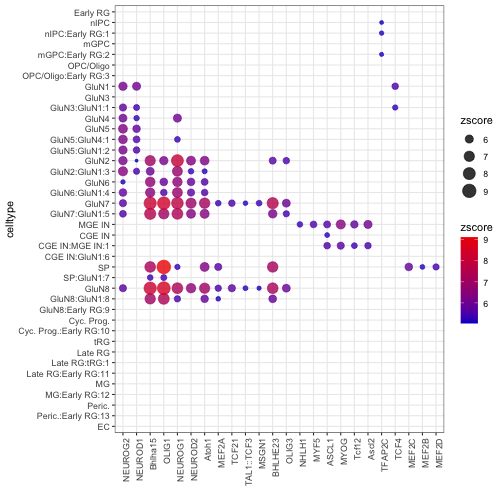

CellWalker2 Vignette
================
Zhirui Hu
2023-12-14


## Introduction

CellWalker2 extends the CellWalker method for combining scRNA-seq data with cell type ontologies to annotate cells and compare (hierarchically related) cell type labels, and combinding multiomic, scATAC-seq and scRNA-seq data with cell type labels and other bulk epigenetic data to interpret bulk level annotations at single cell level (see [paper](https://doi.org/10.1186/s13059-021-02279-1) for algorithmic details). This vignette shows an example of running CellWalker2 on 1) simulated scRNA-seq datasets and 2) a small subset of multiomic, scATAC-seq and scRNA-seq data from human developing cortex (see [paper](https://doi.org/10.1016/j.cell.2021.07.039) ) to generate a cellWalk2 object which can then be used to assign cell type labels to cells, map cell type trees as well as assign cell-type specific labels to bulk level annotations.

CellWalker2 use Gene-by-Cell count matrix as input for scRNA-seq data and Cell-by-Peak matrix as input for scATAC-seq data. scATAC-Seq data can be pre-processed by many pipelines including CellRanger, ArchR, SnapATAC, and Cicero, which outputs Cell-by-Peak matrix. Additionally, marker genes, cell type tree and bulk level annotations can be provided to CellWalker2.

## Getting Started with CellWalker2

Currently, CellWalker2 must be installed useing devtools:


```r
install.packages("devtools")
devtools::install_github("PFPrzytycki/CellWalk@dev")
```

After CellWalkR is installed, load the package:


```r
library(CellWalkR)
```


## Use CellWalker2 for scRNA-Seq data

In this section, we show how to use CellWalker2 to annotate cells by reference cell type labels (or tree) and map similar cell type labels (or trees) using simulated scRNA-Seq datasets. We will generate two datasets using Splatter. To illustrate cell type annotation, we treat dataset 1 as the reference dataset and dataset 2 as unlabeled. We use cell types and marker genes obtained from dataset 1 to annotate cells in dataset2. To illustrate cell type mapping, we use CellWalker2 to identify the correspondence between cell type labels (or trees) from these two datasets.

#### Simulate scRNA-Seq data

We use Splatter to simulate scRNASeq. You might need to install splatter and scater packages. We will simulate four cell types 1,2,3,4, in which (1,2) are in one subtree and (3,4) in another subtree. Then, we split the data into two datasets.


```r
library(scater)
library(splatter)
```


```r
params <- newSplatParams()
ncell = 4000 # total number of cells
# simulate 1400 genes without DE
sim <- splatSimulate(params, nGenes = 1400, batchCells = ncell)

# simulate 200 DE genes between (1,2) and (3,4), batch for different cell types and data sets
sim.groups1 <- splatSimulate(nGenes = 200, batch.facLoc = 0.1, batch.facScale = 0.2,
                             method = "single", verbose = FALSE, batchCells = rep(ncell/2,2)) 

# simulate 150 DE genes between (1,2)
sim.groups2 <- splatSimulate(batch.facLoc = c(0.1,0.1, 0, 0) , batch.facScale = c(0.15, 0.15, 0, 0),
                             nGenes = 150,
                             method = "single", verbose = FALSE, batchCells = rep(ncell/4,4)) 
# simulate 150 DE genes between (3,4)
sim.groups3 <- splatSimulate(batch.facLoc = c(0, 0, 0.1, 0.1) , batch.facScale = c(0, 0, 0.15, 0.15),
                             nGenes = 150,
                             method = "single", verbose = FALSE, batchCells = rep(ncell/4,4))

# combine genes
counts = rbind(sim@assays@data$TrueCounts, sim.groups1@assays@data$TrueCounts,
               sim.groups2@assays@data$TrueCounts, sim.groups3@assays@data$TrueCounts)

# get cell metadata
sim_placeholder <- splatSimulate(params, nGenes = nrow(counts), batchCells = rep(ncell/4, 4))
meta.data = as.data.frame(colData(sim_placeholder)[, 'Batch', drop=F])

# split the cells into two groups
ind = sample(ncell, ncell/2)
meta.data1 = meta.data[ind, , drop=F]
meta.data1$Experiment = 1
meta.data2 = meta.data[-ind,, drop=F]
meta.data2$Experiment = 2
rownames(counts) = paste0('Gene', 1:nrow(counts))
counts1 = counts[, ind]
counts2 = counts[, -ind]
```

#### Cell type annotation

CellWalker2 use Seurat to preprocess scRNA-Seq data. User can provide marker genes for each cell type as a dataframe with columns *gene*, *cluster,* *avg_log2FC* (optional). If not provided, CellWalker2 can compute cell type marker genes from a reference scRNA-Seq dataset. Optionally, user can provide cell type tree as a phylo object. If not provided, CellWalker2 can also build a cell type tree from a reference scRNA-Seq dataset.

We compute cell type markers and the hierarchical relationship between cell type labels using dataset 1. To do that, we use `Batch` column in `mate.data1` as cell label. We also compute cell-to-cell similary graph for dataset 2 as a part of the graph to run random walk.


```r
dataset1 = processRNASeq(counts1, meta.data1, group.col = 'Batch', do.findMarkers = T, 
                         computeKNN = F, buildTree = T)
#> Centering and scaling data matrix
#> Calculating cluster Batch1
#> Calculating cluster Batch3
#> Calculating cluster Batch2
#> Calculating cluster Batch4
dataset2 = processRNASeq(counts2, do.findMarkers = F, computeKNN = T)
#> Centering and scaling data matrix
#> Computing nearest neighbor graph
#> Computing SNN
#> Modularity Optimizer version 1.3.0 by Ludo Waltman and Nees Jan van Eck
#> 
#> Number of nodes: 2000
#> Number of edges: 64582
#> 
#> Running Louvain algorithm...
#> Maximum modularity in 10 random starts: 0.8322
#> Number of communities: 7
#> Elapsed time: 0 seconds
markers = dataset1$markers 
```

Then, we compute the cell-to-label edges based on standardized gene expression level of marker genes.


```r
labelEdges = computeTypeEdges(dataset2$expr_norm, markers)
```

Finally, we annotate cells from dataset2 by cell type labels either hierarchically organized or not. `weight1` is the edge weight ratio between cell-label edges and cell-cell edges, which controls the information that flows from labels to the cells. If it's NULL, CellWalker2 will tune this parameter by a subsample of the cells (specified by `sampleDepth`). This parameter is tuned such that similar cells will have larger influence score. The range of possible values is provided by `labelEdgeOpts`. As tuning will take longer time, we provide the option to run different value in parallel by setting `parallel = T`. If a cell type tree is provided, `wtree` specifies the edge weight between cell type labels.

with hierarchical structure:


```r
results = annotateCells(dataset2$cellGraph, labelEdges, weight1 = NULL, sampleDepth =1000,
                        labelEdgeOpts = 10^seq(-5,3,1),  tr1 = dataset1$tr,
                        wtree = 1)
#> cellHomogeneity at each edgeWeight:
#>    Var1 cellHomogeneity
#> 1 1e-05        7.344859
#> 2 1e-04        7.637210
#> 3 1e-03        7.609625
#> 4 1e-02        6.796334
#> 5 1e-01        5.265232
#> 6 1e+00        4.444708
#> 7 1e+01        4.066864
#> 8 1e+02        4.210668
#> 9 1e+03        4.284148
```

without hierarchical structure:


```r
results = annotateCells(dataset2$cellGraph, labelEdges, weight1 = NULL, sampleDepth =1000,
                        labelEdgeOpts = 10^seq(-5,3,1))
```

with parallel computing in tuning weight1:


```r
results = annotateCells(dataset2$cellGraph, labelEdges, weight1 = NULL, sampleDepth =1000,
                        labelEdgeOpts = 10^seq(-5,3,1), parallel  = T,  numCores = 8)
```

We evaluate results by comparing CellWalker2's results with the true labels of dataset2.


```r
cellLabel = results[[1]]$cellLabels[rownames(meta.data2)] # cell type labels from CellWalker2
true_cluster = meta.data2$Batch
confusion = xtabs(~true_cluster +cellLabel)
message("compare cell annotation with true label: ")
#> compare cell annotation with true label:
print(round(confusion/rowSums(confusion),2))
#>             cellLabel
#> true_cluster Batch1 Batch2 Batch3 Batch4
#>       Batch1   0.95   0.05   0.00   0.00
#>       Batch2   0.00   1.00   0.00   0.00
#>       Batch3   0.00   0.00   1.00   0.00
#>       Batch4   0.00   0.00   0.00   1.00
```

#### Cell types (trees) mapping

To map cell types between dataset1 and dataset2, CellWalker2 needs marker genes for each cell type and (optionally) cell type tree. We've already obtained marker genes for dataset1 in the last section, so we only need to compute markers for dataset 2. This step can be skipped if marker genes (and tree) are provided from external data.


```r
dataset2 = processRNASeq(counts2, meta.data2, group.col = 'Batch', do.findMarkers = T, computeKNN = F, buildTree = T)
#> Centering and scaling data matrix
#> Calculating cluster Batch1
#> Calculating cluster Batch2
#> Calculating cluster Batch3
#> Calculating cluster Batch4
```

Although not the main purpose of CellWalker2, if the dataset is unlabeled, CellWalker2 can identify cell clusters first and map cell clusters among datasets.

Then, we compute the cell-to-label edges based on gene expression level of marker genes, merge the data from both datasets to compute a cell-to-cell graph. If `integrate = F`, just combine the data together without removing batch effect; if `integrate = T`, will use CCA method in Seurat to integrate data.


```r
labelEdges1 = computeTypeEdges(dataset1$expr_norm, dataset1$markers)
labelEdges2 = computeTypeEdges(dataset2$expr_norm, dataset2$markers)
labelEdgesList = list(labelEdges1, labelEdges2) # make sure that cell names are different in each dataset
mergeResult =  mergeRNASeq(list(counts1, counts2), integrate = F) # make sure that cell names are different in each dataset. if there are cell names are duplicated, will add '_x' to cell names
```

Finally, we run CellWalker2 to map the cell types from two datasets either with or without the hierarchical structure of cell type labels. We set `labelEdgeWeight = NULL`, so CellWalker2 will tune the weight ratio between cell-to-label edges and cell-to-cell edges for each set of label, which controls the information that flows from labels to the cells. These parameters are tuned such that similar cells will have larger influence. By setting `parallel = T` and specifying `numCores`, CellWalker2 will tune edgeWeights in parallel. `sampleDepth` specifies the number of cells subsampled to tune these parameters. Smaller sample size will accelerate tuning but might be less optimal.

If `compute.Zscore = T`, CellWalker2 will compute Z-scores by comparing the observed influence score with its null distribution generated by permuting cell-to-label edges. Otherwise, CellWalker2 will output influence score matrix between labels only. `nround` is the number of randomization to compute Z-scores.

CellWalker2 will output influence scores or Z-scores from cell types in dataset1 to that in dataset2 and vice versa. For Z-scores, they could be different but similar.

CellWalker2 uses `%dppar%` to run each randomization parellally. `foreach` and `doParallel` packages are required and you need to register the parallel backend before running `mapCellTypes`.


```r
library(foreach)
library(doParallel)
cl<-makeCluster(8)
registerDoParallel(cl)  # for computing Z-score
```

with hierarchical structure:


```r
treeList = list(dataset1$tr, dataset2$tr)
cellWalk2 = mapCellTypes(mergeResult$cellGraph, labelEdgesList, labelEdgeWeights = NULL,
                         treeList = treeList, compute.Zscore = TRUE,  nround = 31,
                         parallel  = T,  sampleDepth =1000, numCores = 8)
#> tunning labelEdgeWeights...
#> cellHomogeneity at optimal edgeWeight:
#>    Var1  Var2 cellHomogeneity
#> 1 1e-04 1e-04        9.932882
#> run CellWalker:
```

without hierarchical structure:


```r
cellWalk2 = mapCellTypes(mergeResult$cellGraph, labelEdgesList, labelEdgeWeights = NULL,
                         compute.Zscore = TRUE,  nround = 31, parallel  = T,  
                         sampleDepth =1000, numCores = 8)

```

By default, CellWalker2 will permute the edge weights between cells to each set of cell type labels independently. We can also choose which set of cell-to-label edges to permute and/or to restrict permutation within cell groups by setting `groupsList`, as sometimes we want to maintain the (phylogenetic) correlation of edge weights between cell type labels.

Here we show how to only permute edges between cells to labels of dataset2 as we want to map each cell type label in dataset 2 to dataset 1 and keep the hierarchical structure of labels in dataset 1. For edges between cells to labels in dataset1, we set all the cells to group 0 so the edge weights are not permuted. For edges between cells to labels in dataset2, we set all the cells to a single group so that edge weights are permuted between all the cells to labels.

Moreover, we can adjust the edge weight going up and down the cell type tree to discourage information going across lineages. In this case, as we only consider the information flow from dataset 2 to dataset 1, for cell type tree in dataset 1, we set the edge weight going up the tree (from tips to root) to 1 and down to 0.1, and set them reversely for cell tree in dataset 2.

Though CellWalker2 will output scores in both directions, the influence scores or Z-scores from dataset 2 to dataset 1 should be used in this setting.


```r
# different weights going up/down the tree
groupsList = list(rep(0, nrow(labelEdges1)), rep(1, nrow(labelEdges2)))
wtrees = matrix(c(1,0.1,0.1,1), ncol=2) # first row for dataset 1 and second for dataset 2
cellWalk2 = mapCellTypes(mergeResult$cellGraph, labelEdgesList, labelEdgeWeights = NULL,
                         treeList = treeList, wtrees = wtrees, groupsList = groupsList,
                         compute.Zscore = TRUE, nround = 31, parallel  = T,  
                         sampleDepth =1000, numCores = 8)
```

Alternatively, we can connect all the cells to both marker sets if the genes from both datasets are mostly shared.


```{.r .fold-hide}
labelEdges1 = rbind(computeTypeEdges(dataset1$expr_norm, dataset1$markers),
              computeTypeEdges(dataset2$expr_norm, dataset1$markers))
labelEdges2 = rbind(computeTypeEdges(dataset1$expr_norm, dataset2$markers),
              computeTypeEdges(dataset2$expr_norm, dataset2$markers))
labelEdgesList = list(labelEdges1, labelEdges2) # make sure that cell names are different in each dataset
```

We check Z-score matrix by CellWalker2 to see if the same cell types from these two datasets having larger Z-scores.


```r
Zscore = cellWalk2$zscore[[2]]
res = RcppHungarian::HungarianSolver(-Zscore[1:(nrow(Zscore) -1),1:(ncol(Zscore) -1)])$pairs # no root, remove '-1' if running without tree
res[,1] = sapply(rownames(Zscore)[res[,1]], function(x) strsplit(x, '_')[[1]][1])
res[,2] = sapply(colnames(Zscore)[as.numeric(res[,2])], function(x) strsplit(x, '_')[[1]][1])
colnames(res) = c('cell labels 1', 'cell labels 2')
message("matching cell labels with Zscore (with tree): ")
#> matching cell labels with Zscore (with tree):
print(res) # mapping cell types using Zscore
#>      cell labels 1     cell labels 2    
#> [1,] "Batch1"          "Batch1"         
#> [2,] "Batch2"          "Batch2"         
#> [3,] "Batch3"          "Batch3"         
#> [4,] "Batch4"          "Batch4"         
#> [5,] "Batch3:Batch2:3" "Batch3:Batch2:3"
#> [6,] "Batch4:Batch2:2" "Batch4:Batch2:2"
```

CellWalker can also map more than two datasets (not shown here).

## Use CellWalker2 for ATAC-Seq and RNA-Seq data

In this section, we will use CellWalker2 to 1) assign cell type labels to predicted regulatory regions (pREs) identified from basal ganglia vs cortex (see [paper](https://doi.org/10.1016/j.cell.2020.06.002)) in human developing cortex and 2) identify enriched TF motifs within pREs that tend to be more open in specific cell types (or cell type specific pREs?).

#### Load data

We load subset of multiomic, scRNA-Seq and scATAC-Seq data from human developing cortex ([GSE162170](https://www.ncbi.nlm.nih.gov/geo/query/acc.cgi?acc=GSE162170)). For ATAC-Seq, we need to input a peak-by-cell count matrix accompanied with a peak coordinate matrix with the same rows. We can also load cell type tree as a phylo object and cell type markers. We rename some of the columns to make them readable by CellWalker2.


```r
# load single cell data
# 'data/SampleCellTypeTree.rda' should be loaded upon loading the package
devtools::load_all() # load SampleCortexSingleCellData
#> ℹ Loading CellWalkR

ATAC_Mat = SampleCortexSingleCellData$ATAC_Mat
peaks = SampleCortexSingleCellData$peaks
ATAC_Mat0 = SampleCortexSingleCellData$ATAC_Mat0
peaks0 = SampleCortexSingleCellData$peaks0
counts = SampleCortexSingleCellData$counts
counts2 = SampleCortexSingleCellData$counts2
RNA_markers = SampleCortexSingleCellData$RNA_markers
tr = SampleCellTypeTree

colnames(RNA_markers)[5] = 'p_val_adj' # will be used for select markers
colnames(peaks)[1:3] = c('seqnames', 'start', 'end')
```

#### Process RNASeq data

We first normalize and standarize scRNA-Seq data for both RNASeq part of multiomic data and unpaired RNASeq data. We don't need to compute cell type markers and build cell tree as they are already provided. We also don't need to compute cell-to-cell similarities as it will be computed by integrating all sources of data in the following step.


```r
dataset1 = processRNASeq(counts, do.findMarkers = F, computeKNN = F, computeSimilarity = F, 
                         buildTree = F) # RNASeq part of multiomic data, normalize data
dataset2 = processRNASeq(counts2, do.findMarkers = F, computeKNN = F, computeSimilarity = F, 
                         buildTree = F) # unpaired RNASeq, normalize data
```

#### Compute cell-to-cell type edges

Then we can compute cell to cell type edges based on standarized marker gene expression. Users can adjust the p-values and log2 fold change cutoff to select markers for computing edge weights. Here we just use the default values.


```r
# option 1: connect all cells with RNA data to cell types
labelEdges1 = computeTypeEdges(dataset1$expr_norm, RNA_markers)
labelEdges2 = computeTypeEdges(dataset2$expr_norm, RNA_markers)
labelEdges = rbind(labelEdges1, labelEdges2)
```

Users can also choose which cells to be connected to cell types.


```r
# option 2: connect only cells with unpaired RNA data to cell types
labelEdges = computeTypeEdges(dataset2$expr_norm, RNA_markers)
```

#### Construct cell-to-cell graph

Next, we construct cell-to-cell graph by integrating all the single cell data. For current version of CellWalker2, multiomic data is required and unpaired scRNA-Seq or scATAC-Seq data can be added to the graph. CellWalker2 will compute cell-to-cell similarity based on gene expression and chromatin accessibility, construct KNN graph and output shared K nearest neighbors between each pair of cells.

For gene expression, user can adjust the dimensions of PCs to compute cell-to-cell distance (`ndim`). for chromatin accessibility, user can choose the similarity metric among Cosine, Jaccard, or LSI. Additionally, `ATAC_weight` specifies the weight of ATACSeq similarity for multiomic data (the weight for RNASeq is 1-`ATAC_weight`).


```r
cellgraph = constructCellGraph(counts, ATAC_Mat0, peaks0, counts2, ATAC_Mat, peaks) # with ATACSeq
```

We can also construct cell graph without unpaired scATAC-Seq:


```r
cellgraph = constructCellGraph(counts,ATAC_Mat0, peaks0, counts2) # without ATACSeq
```

#### Map region-specific pREs to cell types

We further input basal ganglia or cortex specific pREs and compute cell-to-label edges. In this case, the labels are *basal ganglia* and *cortex*. The edge weight is based on the chromatin accessibility of basal ganglia or cortex pREs in the cell.


```r
pRE = read.csv(system.file("extdata", "pRE_region_bg_cortex.csv", package = "CellWalkR"))
colnames(pRE)[c(1,11)] = c('seqnames', 'cluster') #rename some column names to be readable by CellWalker2

labelEdges1 = computeBulkEdges(pRE, peaks0, ATAC_Mat0)
labelEdges2 = computeBulkEdges(pRE, peaks, ATAC_Mat) 
labelEdges2 = rbind(labelEdges1, labelEdges2) # connect all ATAC cells to bulk annotations
```

Alternatively, we can only connect unpaired ATAC cells to bulk annotations:


```r
labelEdges2 = computeBulkEdges(pRE, peaks, ATAC_Mat) 
```

Finally, we assign cell type labels to basal ganglia or cortex specific pREs. By default, `compute.Zscore = T`, CellWalker2 will compute Z-scores by comparing the observed influence score with its null distribution generated by permuting cell-to-cell type edges. Otherwise, CellWalker2 will output influence score matrix from bulk labels to cell types only. `nround` is the number of randomization to compute Z-scores.

We set `labelEdgeWeight = NULL`, so CellWalker2 will tune the weight ratio between cell-to-label edges and cell-to-cell edges for both cell type labels and bulk annotations to minimize the entropy mapping each bulk annotation to cell types.


```r
cellWalk2 = annotateBulkRegion(cellgraph, labelEdges, labelEdges2, tr1 = tr, wtree = c(1, 0.1),
                               labelEdgeWeights = NULL, sampleDepth = 2000,  parallel = T, 
                               numCores = 8) # with tuning edgeWeights
#> tunning labelEdgeWeights...
#> labelHomogeneity at optimal edgeWeight:
#>     Var1 Var2 cellHomogeneity
#> 45 10000    1       0.1057033
#> run CellWalker:
```

If you don't want to tune `leblEdgeWeight`, you can use the following command using the default values or input other values.


```r
cellWalk2 = annotateBulkRegion(cellgraph, labelEdges, labelEdges2, tr1 = tr, wtree = c(1, 0.1))
```

We plot Z-score on the cell type tree to compare the cell type specificity of different bulk annotations.


```r
tr$node.label = colnames(cellWalk2$zscore)[-1:-(tr$Nnode+1)]
p1 = plotZscoreTree(tr, cellWalk2$zscore, cutoff = 3)
p1
```


#### Identify cell type specific TFs

First, we input the genomic coordinates of pREs as a bed file and identify TF motifs from JASPAR2020 within each pRE using Signac. For faster computation in this demo, we also filter for TF motifs that occur more frequently. The result file contains the genomic coordinates of each pRE and the motifs within it. Currently only hg38 is supported in `findMotifs` but users can input custom motifs file.


```r
pRE = read.table(system.file("extdata", "pRE-hg38.bed", package = "CellWalkR"))
colnames(pRE) = c('seqnames', 'start', 'end')
motifs = findMotifs(pRE)
#> Warning: Keys should be one or more alphanumeric characters followed by an underscore, setting key from peaks to peaks_
#> Building motif matrix
#> Finding motif positions
#> Creating Motif object

motifs = data.table::as.data.table(motifs)
motifs[, count:= .N, by = cluster] # select TFs appear in more pREs
motifs = as.data.frame(motifs[count > 1000])
```

Then, we compute cell-to-label edges. We treat each TF as a bulk label and each TF connects to each cell through the chromatin accessibilty of pREs containing the TF motif. We connect both cells from multiomic and unpaired ATACSeq to TFs.


```r
labelEdges1 = computeBulkEdges(motifs, peaks0, ATAC_Mat0)
labelEdges2 = computeBulkEdges(motifs, peaks, ATAC_Mat)
labelEdges2 = rbind(labelEdges1, labelEdges2)
```

Finally, we identify TFs whose motifs are enriched in pREs that are active in specific cell types. We convert `motifs` to a binary matrix showing the present/absence of motif in each pRE that can be used by `annotateBulkRegion`.

Different from previous section, we randomly assign pREs to motifs to generate the null distribution for computing Z-scores. We set `groups1` to all zero as no permutation between cell-to cell types edges and `group2` to all one as permutations occur between all motifs and regions. We need to input count matrix and peaks for ATACSeq data as we need to recompute `labelEdges` for each randomization.


```r
regionMat = convertToMatrix(motifs) # a data.table with sequence name of pRE as the first column and clusters (TFs) as the following columns
groups1 =  rep(0, nrow(labelEdges)) # no permutation between cell-to cell types edges
groups2 = rep(1, nrow(regionMat)) # permutation between all motifs and regions
cellWalk2 = annotateBulkRegion(cellgraph, labelEdges, labelEdges2, groups1, groups2,
                               regionMat, list(ATAC_Mat0, ATAC_Mat), list(peaks0, peaks), 
                               tr1 = tr, wtree = c(1, 0.1), labelEdgeWeights = NULL, sampleDepth = 2000,
                               parallel = T, numCores = 8)
#> tunning labelEdgeWeights...
#> labelHomogeneity at optimal edgeWeight:
#>     Var1 Var2 cellHomogeneity
#> 45 10000    1      0.09701262
#> run CellWalker:
```

We can visualize Z-scores using dotplot. Each row is a cell type including internal nodes on the tree and each column is a TF. The internal node is names by two cell types among its desendents and the depth of the node.


```r
Zscore = cellWalk2$zscore[, tr$edge[,2]] # reorder cell types so that cell types closer in the tree will be closer on the heatmap
p1 = plotZscoreDotplot(Zscore, th = 5)
p1
```



## Session Information


```r
sessionInfo()
#> R version 4.2.1 (2022-06-23)
#> Platform: aarch64-apple-darwin20 (64-bit)
#> Running under: macOS Monterey 12.6
#> 
#> Matrix products: default
#> LAPACK: /Library/Frameworks/R.framework/Versions/4.2-arm64/Resources/lib/libRlapack.dylib
#> 
#> locale:
#> [1] en_US.UTF-8/en_US.UTF-8/en_US.UTF-8/C/en_US.UTF-8/en_US.UTF-8
#> 
#> attached base packages:
#> [1] parallel  stats4    stats     graphics  grDevices utils     datasets  methods   base     
#> 
#> other attached packages:
#>  [1] CellWalkR_1.0.0             doParallel_1.0.17           iterators_1.0.14            foreach_1.5.2               splatter_1.21.1             scater_1.26.1               ggplot2_3.4.2              
#>  [8] scuttle_1.8.4               SingleCellExperiment_1.20.1 SummarizedExperiment_1.28.0 Biobase_2.58.0              MatrixGenerics_1.10.0       matrixStats_1.0.0           GenomicRanges_1.50.2       
#> [15] GenomeInfoDb_1.34.9         IRanges_2.32.0              S4Vectors_0.36.2            BiocGenerics_0.44.0        
#> 
#> loaded via a namespace (and not attached):
#>   [1] rtracklayer_1.58.0                scattermore_1.2                   R.methodsS3_1.8.2                 SeuratObject_4.1.3                tidyr_1.3.0                      
#>   [6] JASPAR2020_0.99.10                bit64_4.0.5                       knitr_1.43                        irlba_2.3.5.1                     DelayedArray_0.24.0              
#>  [11] R.utils_2.12.2                    data.table_1.14.8                 KEGGREST_1.38.0                   TFBSTools_1.36.0                  RCurl_1.98-1.12                  
#>  [16] generics_0.1.3                    ScaledMatrix_1.6.0                callr_3.7.3                       cowplot_1.1.1                     usethis_2.2.1                    
#>  [21] RSQLite_2.3.1                     RANN_2.6.1                        future_1.32.0                     bit_4.0.5                         tzdb_0.4.0                       
#>  [26] spatstat.data_3.0-1               httpuv_1.6.11                     DirichletMultinomial_1.40.0       viridis_0.6.3                     xfun_0.39                        
#>  [31] hms_1.1.3                         evaluate_0.21                     promises_1.2.0.1                  fansi_1.0.4                       restfulr_0.0.15                  
#>  [36] caTools_1.18.2                    igraph_1.5.0                      DBI_1.1.3                         htmlwidgets_1.6.2                 spatstat.geom_3.2-1              
#>  [41] purrr_1.0.1                       ellipsis_0.3.2                    ggnewscale_0.4.9                  backports_1.4.1                   dplyr_1.1.2                      
#>  [46] annotate_1.76.0                   deldir_1.0-9                      sparseMatrixStats_1.10.0          vctrs_0.6.3                       remotes_2.4.2                    
#>  [51] ROCR_1.0-11                       abind_1.4-5                       cachem_1.0.8                      withr_2.5.0                       BSgenome.Hsapiens.UCSC.hg38_1.4.5
#>  [56] BSgenome_1.66.3                   progressr_0.13.0                  checkmate_2.2.0                   sctransform_0.3.5                 GenomicAlignments_1.34.1         
#>  [61] treeio_1.22.0                     prettyunits_1.1.1                 goftest_1.2-3                     cluster_2.1.4                     ape_5.7-1                        
#>  [66] lazyeval_0.2.2                    seqLogo_1.64.0                    crayon_1.5.2                      spatstat.explore_3.2-1            labeling_0.4.2                   
#>  [71] pkgconfig_2.0.3                   nlme_3.1-162                      vipor_0.4.5                       pkgload_1.3.2                     devtools_2.4.5                   
#>  [76] rlang_1.1.1                       globals_0.16.2                    lifecycle_1.0.3                   miniUI_0.1.1.1                    rsvd_1.0.5                       
#>  [81] rprojroot_2.0.3                   polyclip_1.10-4                   lmtest_0.9-40                     Matrix_1.5-4.1                    aplot_0.1.10                     
#>  [86] zoo_1.8-12                        beeswarm_0.4.0                    ggridges_0.5.4                    processx_3.8.1                    png_0.1-8                        
#>  [91] viridisLite_0.4.2                 rjson_0.2.21                      bitops_1.0-7                      R.oo_1.25.0                       KernSmooth_2.23-21               
#>  [96] Biostrings_2.66.0                 blob_1.2.4                        DelayedMatrixStats_1.20.0         stringr_1.5.0                     parallelly_1.36.0                
#> [101] spatstat.random_3.1-5             readr_2.1.4                       gridGraphics_0.5-1                CNEr_1.34.0                       beachmat_2.14.2                  
#> [106] scales_1.2.1                      memoise_2.0.1                     magrittr_2.0.3                    plyr_1.8.8                        ica_1.0-3                        
#> [111] zlibbioc_1.44.0                   compiler_4.2.1                    BiocIO_1.8.0                      RColorBrewer_1.1-3                fitdistrplus_1.1-11              
#> [116] Rsamtools_2.14.0                  cli_3.6.1                         XVector_0.38.0                    urlchecker_1.0.1                  listenv_0.9.0                    
#> [121] patchwork_1.1.2                   pbapply_1.7-0                     ps_1.7.5                          MASS_7.3-60                       tidyselect_1.2.0                 
#> [126] stringi_1.7.12                    RcppHungarian_0.2                 highr_0.10                        yaml_2.3.7                        locfit_1.5-9.8                   
#> [131] BiocSingular_1.14.0               ggrepel_0.9.3                     grid_4.2.1                        fastmatch_1.1-3                   tools_4.2.1                      
#> [136] future.apply_1.11.0               rstudioapi_0.14                   TFMPvalue_0.0.9                   gridExtra_2.3                     farver_2.1.1                     
#> [141] Rtsne_0.16                        digest_0.6.31                     shiny_1.7.4                       pracma_2.4.2                      motifmatchr_1.20.0               
#> [146] Rcpp_1.0.10                       later_1.3.1                       RcppAnnoy_0.0.20                  httr_1.4.6                        AnnotationDbi_1.60.2             
#> [151] colorspace_2.1-0                  brio_1.1.3                        XML_3.99-0.14                     fs_1.6.2                          tensor_1.5                       
#> [156] reticulate_1.34.0                 splines_4.2.1                     uwot_0.1.15                       yulab.utils_0.0.6                 RcppRoll_0.3.0                   
#> [161] tidytree_0.4.2                    spatstat.utils_3.0-3              sp_2.0-0                          ArchR_1.0.2                       ggplotify_0.1.0                  
#> [166] plotly_4.10.2                     sessioninfo_1.2.2                 xtable_1.8-4                      jsonlite_1.8.5                    ggtree_3.6.2                     
#> [171] poweRlaw_0.70.6                   testthat_3.1.9                    ggfun_0.1.1                       R6_2.5.1                          profvis_0.3.8                    
#> [176] pillar_1.9.0                      htmltools_0.5.5                   mime_0.12                         glue_1.6.2                        fastmap_1.1.1                    
#> [181] BiocParallel_1.32.6               BiocNeighbors_1.16.0              codetools_0.2-19                  pkgbuild_1.4.2                    Signac_1.10.0                    
#> [186] utf8_1.2.3                        lattice_0.21-8                    spatstat.sparse_3.0-2             tibble_3.2.1                      ggbeeswarm_0.7.2                 
#> [191] leiden_0.4.3                      gtools_3.9.4                      GO.db_3.16.0                      limma_3.54.2                      survival_3.5-5                   
#> [196] rmarkdown_2.22                    desc_1.4.2                        munsell_0.5.0                     GenomeInfoDbData_1.2.9            reshape2_1.4.4                   
#> [201] gtable_0.3.3                      Seurat_4.3.0.1
```
